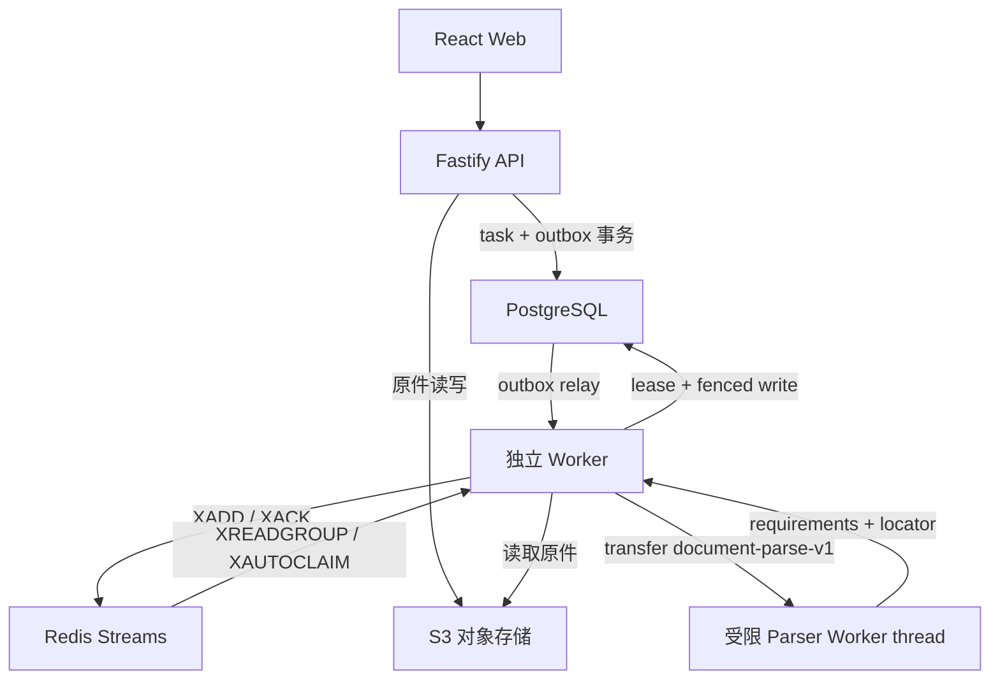
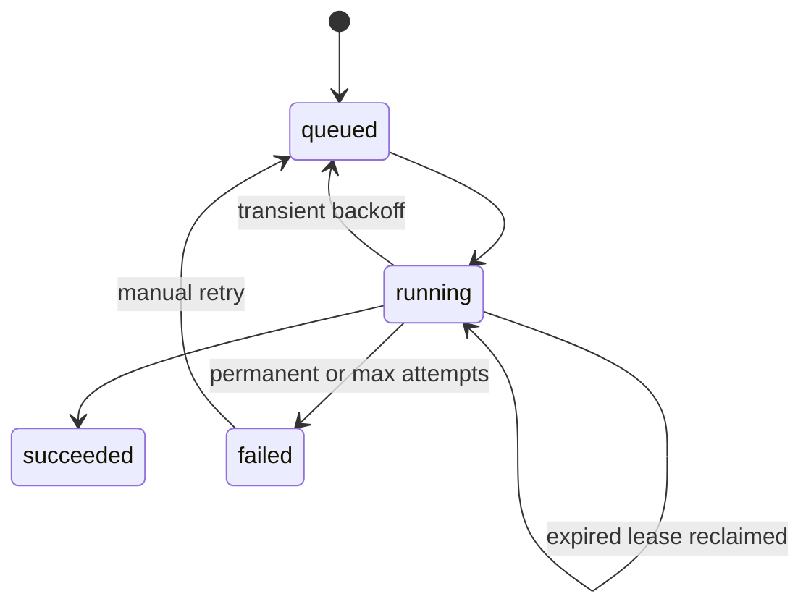

# AiBidV3 MVP 技术方案

> 状态：Phase C2.1 数字文档解析纵向切片
> 适用范围：MVP 研发、接口评审、部署与验收  
> 最后更新：2026-07-11

## 1. 目标与原则

MVP 的首要目标不是一次性实现完整投标平台，而是将现有高保真原型逐步替换为可持久化、可追溯、可恢复的真实业务闭环：

```text
创建项目 → 上传招标文件 → 异步解析 → 查看进度 → 提取要求 → 人工确认
```

工程决策遵循以下原则：

1. **先验证高风险能力**：文件解析、原文定位、DOCX 导出和 AI 事实约束先于外围功能。
2. **契约先行**：前后端以 [`api/openapi.yaml`](api/openapi.yaml) 为接口事实来源，Mock 与真实 API 使用相同数据结构。
3. **租户隔离默认开启**：业务表从第一天携带 `tenant_id`，不得依赖前端过滤实现隔离。
4. **异步状态可恢复**：PostgreSQL 保存业务与任务事实；Redis Streams 只承担任务通知与 pending 管理，不作为最终状态来源。
5. **可靠交付与解析能力解耦**：Phase C1 先把 outbox、队列、租约和 durable worker 做可靠；C2.1 在不改变任务资源与交付协议的前提下接入隔离数字文档解析。
6. **可观测、可审计**：关键状态变更带请求、用户、租户和任务关联标识。

## 2. 范围

### 2.1 当前 Phase C1 + C2.1 交付

- Node.js 24 LTS、Fastify 5、TypeScript 后端工程骨架。
- 项目、文件、解析任务、提取要求的 API 契约。
- PostgreSQL、Redis、S3 兼容对象存储、API 与独立 worker 的本地开发编排。
- API 在同一 PostgreSQL 事务内写任务和 outbox，不直接写 Redis；worker relay 使用 Redis Streams consumer group 投递与消费。
- PostgreSQL 任务租约、心跳、fencing token、最大尝试次数、指数退避和 pending 消息接管。
- PostgreSQL 新上传创建 `document-parse-v1`；durable worker 在线程隔离、60 秒默认超时和 256 MiB old-generation 默认上限内解析数字 PDF、DOCX 与严格 UTF-8 TXT。
- `deterministic-rules-v1` 要求提取，以及带源文件/quote 哈希、规范化文本范围和 PDF/DOCX/TXT 格式锚点的 version 1 locator。
- 默认内存模式与历史 `development-document-parse` 任务继续使用明确标记的 `development-fixture`，保持零依赖联调和旧数据兼容。
- 任务进度、失败、人工重试与公开 `attempt` 所需的状态模型和错误格式；租约内部字段不通过 API 暴露。
- 高保真前端默认继续使用 Mock 数据和 `localStorage`；显式切换 API 数据源后可展示任务和真实 locator 证据，Mock 目标能力仍不得混同为后端已交付能力。
- 前后端构建、类型检查、测试，以及 PostgreSQL/MinIO/Redis 的 outbox → worker → 隔离 parser → 真实 TXT 证据持久化 smoke。

C2.1 已交付确定性的数字文档解析，但不声称达到生产解析准确率。S3 模式下新上传原件进入私有对象存储，PostgreSQL 只保存对象引用和业务事实；`project_files.content bytea` 仅为迁移前旧数据和回滚兼容保留，新上传不得依赖该列。

### 2.2 后续 MVP

- Phase C2.2：扫描件/OCR、原件 viewer/download、可验证高亮，以及脱敏生产基准语料、准确率阈值和容量 SLO。
- 响应矩阵、目录规划、AI 写作、评审与正式 DOCX 导出。
- 企业级身份源、项目级授权、审计查询、配额与限流。

### 2.3 非目标

- 当前阶段不实现知识库、模板中心、复杂审批、多人实时协同。
- 当前阶段不支持扫描 PDF/OCR、legacy `.doc`、原件 viewer/download 或已验证高亮。
- 不在 API 请求生命周期内执行真实的大文件解析或模型推理。
- 不把本地开发凭据、生产密钥、用户文件或解析产物提交到 Git。
- 不以 Redis、浏览器 `localStorage` 或对象存储元数据替代业务数据库。

## 3. 技术基线

| 层级 | 基线 | 说明 |
|---|---|---|
| Web | React + TypeScript + Vite | 当前高保真原型位于 `frontend/` |
| API | Node.js 24 LTS + Fastify 5 + TypeScript | REST、校验、鉴权上下文、业务编排 |
| Worker | Node.js 24 LTS + TypeScript | outbox relay、Redis 消费、租约心跳、parser 路由与受限 Worker thread |
| 关系数据 | PostgreSQL 16 | 业务事实、任务状态、审计与事务 |
| 任务通知 | Redis 7 Streams | consumer group 与 pending 接管；PostgreSQL 仍是任务事实来源 |
| 文件存储 | S3 兼容对象存储 | 本地使用 MinIO且 API 已接入；生产可替换为云对象存储 |
| 接口契约 | OpenAPI 3.1 | camelCase JSON；成功响应统一 `{ "data": ... }` |
| 错误协议 | RFC 7807 | `application/problem+json` |
| 本地编排 | Docker Compose | 配置位于 `deploy/`，构建上下文指向 `../backend` |

## 4. 总体架构



### 4.1 模块边界

- **Web**：交互、乐观状态和轮询展示；不持有权限判断或解析事实。
- **API**：身份与租户上下文、输入校验、项目授权、S3 原件写入、任务与 outbox 的数据库事务；不连接 Redis，不执行 PostgreSQL 模式解析。
- **Outbox Relay**：在 worker 进程内用短租约领取数据库事件，`XADD` 成功后标记 published；重复发布是允许的。
- **Redis Streams**：保存任务通知、consumer group 与 pending 状态，不保存任务业务事实。
- **Parser Port**：接收文件版本，产出结构化要求和 locator；不直接依赖 HTTP 层。
- **Dev Parser Adapter**：只服务默认内存模式与历史任务，生成明确标记的固定结果，并可用开发延迟模拟异步状态。
- **Durable Worker**：独立进程，从 Redis consumer group 获取消息，先领取 PostgreSQL 租约，再读取 S3 原件并以 lease token 条件写回结果；主线程持续续租。
- **Isolated Parser Runtime**：按任务类型启动受限 Worker thread，使用可转移的独占字节副本执行 PDF/DOCX/TXT 解析；超时、资源上限或租约丢失会终止子线程。
- **PostgreSQL**：业务与任务的唯一事实来源。
- **S3**：保存原始文件；后续扩展标准化中间件、解析产物和导出文件。数据库保存对象键、版本及校验元数据。

当前 PostgreSQL 路径是 `API → S3 原件 + PostgreSQL 元数据/任务/outbox → worker relay → Redis Stream → worker fenced execution → PostgreSQL 结果`。API 只提交数据库侧任务事实，Redis 暂时不可用时 outbox 继续积压。迁移前的 `bytea` 行仍可读取，但不再是 S3 模式的新写入路径。MinIO bucket 由 Compose 初始化为私有。

API 与 worker 通过任务 ID 解耦；Redis 消息不携带文件正文或解析结果。C2.1 保留该边界，由 worker 从数据库和 S3 重新加载受租户约束的不可变输入，再把字节转移到隔离 parser。

## 5. 仓库与运行边界

```text
AiBidV3/
├── frontend/              # React Web
├── backend/               # Fastify API、独立 worker 与共享领域/基础设施代码
├── deploy/                # 本地编排和环境变量示例
├── docs/
│   ├── api/openapi.yaml   # API 契约
│   ├── adr/               # 架构决策记录
│   └── MVP_TECHNICAL_DESIGN.md
└── README.md
```

从仓库根目录执行应用命令时应显式指定工作目录；不要把依赖安装回根目录。

| 工作项 | 工作目录 | 产物/检查 |
|---|---|---|
| 前端依赖与构建 | `frontend/` | `frontend/dist/` |
| 前端类型/测试 | `frontend/` | typecheck、lint、test |
| 后端依赖与构建 | `backend/` | `backend/dist/` |
| 后端类型/测试 | `backend/` | typecheck、lint、test |
| 本地基础设施 | `deploy/` | `docker compose ...` |

## 6. 数据模型

以下为目标逻辑模型；当前实现只落地纵向切片需要的字段，但不得破坏租户键和外键方向。`project_files.content bytea` 是有明确退出条件的兼容字段，不属于目标模型。

| 实体 | 关键字段 | 约束与用途 |
|---|---|---|
| `tenants` | `id`, `name`, `status` | 企业租户 |
| `users` | `id`, `external_subject`, `display_name` | 全局身份，不直接决定业务权限 |
| `tenant_memberships` | `tenant_id`, `user_id`, `role` | 租户级成员与角色 |
| `projects` | `id`, `tenant_id`, `name`, `status`, `created_by` | 投标项目 |
| `project_members` | `tenant_id`, `project_id`, `user_id`, `role` | 项目级授权 |
| `files` | `id`, `tenant_id`, `project_id`, `object_key`, `object_version_id`, `object_etag`, `object_stored_at`, `sha256`, `media_type`, `size_bytes`, `status` | 文件元数据和不可变对象引用；`content` 仅兼容旧行 |
| `tasks` | `id`, `tenant_id`, `project_id`, `file_id`, `status`, `progress`, `attempt`, `next_attempt_at`, `lease_token`, `lease_owner`, `lease_expires_at`, `dead_lettered_at`, `error` | 异步任务事实；同一任务行原子保存退避门禁与服务端 fencing 字段 |
| `task_outbox` | `id`, `tenant_id`, `task_id`, `available_at`, `publish_attempts`, `published_at`, `lease_owner`, `lease_expires_at`, `last_error` | 与任务同事务创建的可靠投递事件 |
| `requirements` | `id`, `tenant_id`, `project_id`, `file_id`, `content`, `category`, `locator`, `confirmation_status` | 从文件提取并由人确认的要求 |
| `audit_events` | `id`, `tenant_id`, `actor_id`, `action`, `resource_type`, `resource_id`, `occurred_at` | 安全与业务审计 |

### 6.1 通用约束

- 所有业务主键使用 ULID；API 路径参数按 26 位 Crockford Base32 校验。
- 所有租户业务表包含 `tenant_id`；唯一键和外键应优先包含 `tenant_id`。
- 时间统一存储 UTC，API 使用 RFC 3339 字符串。
- **目标态**文件内容不得写入数据库；原件上传后不可原位覆盖，新内容创建新文件版本。
- **迁移兼容例外**允许旧行继续使用 `project_files.content bytea`；S3 模式的新上传必须保存对象键，不得静默回退到数据库字节。
- 软删除字段不代替审计；删除需同时制定 S3 保留和延迟清理策略。
- 对 `projects(tenant_id, updated_at)`、`files(tenant_id, project_id)`、`tasks(tenant_id, project_id, created_at)`、`requirements(tenant_id, project_id)` 建立索引。

### 6.2 租户与权限边界

请求上下文由认证层生成：

```ts
type RequestContext = {
  requestId: string;
  tenantId: string;
  userId: string;
  tenantRole: "owner" | "admin" | "member" | "viewer";
};
```

生产环境的 `tenantId` 和 `userId` 必须来自已验证的令牌/会话，不接受请求体、查询参数或自定义请求头覆盖。当前开发环境使用 `DEV_TENANT_ID`，并允许 `x-tenant-id` 请求头覆盖以测试隔离；这不是认证，生产部署前必须移除。仓储接口始终强制传入 `tenantId`。

授权顺序固定为：

1. 验证身份和租户成员关系。
2. 以 `tenant_id + resource_id` 查询资源；跨租户资源统一返回 `404`，避免枚举。
3. 检查租户角色和项目角色是否允许动作。
4. 记录高价值写操作审计事件。

最低角色建议：

| 动作 | viewer | member | reviewer | projectAdmin |
|---|---:|---:|---:|---:|
| 查看项目/文件/要求 | ✓ | ✓ | ✓ | ✓ |
| 上传文件/发起解析 |  | ✓ | ✓ | ✓ |
| 确认要求 |  | ✓ | ✓ | ✓ |
| 审批与关闭阻断项 |  |  | ✓ | ✓ |
| 管理项目成员/删除项目 |  |  |  | ✓ |

当前阶段即使暂未接入完整身份源，也必须在领域服务与仓储方法中保留租户参数，避免未来补做高风险数据迁移。

## 7. 文件与对象存储

阶段 B 已接入 S3 兼容对象存储。Compose 使用 MinIO；新上传原件进入私有 bucket，PostgreSQL 保存 `object_key`、`object_version_id`、`object_etag`、`object_stored_at` 与 SHA-256。旧 `bytea` 行继续兼容读取，等待后续校验迁移。

推荐对象键：

```text
tenants/{tenantId}/projects/{projectId}/files/{fileId}/v{version}/original
tenants/{tenantId}/projects/{projectId}/files/{fileId}/v{version}/normalized/{artifact}
tenants/{tenantId}/projects/{projectId}/exports/{exportId}/{filename}
```

- Bucket 默认私有；浏览器不直接使用永久凭据。
- 当前上传经 API multipart 转发并受 25 MiB 硬上限约束；部署只能收紧；后续大文件再切换为短期预签名分片上传。
- 下载通过短期预签名 URL 或鉴权流式接口；日志不得记录签名查询参数。
- API 上传边界校验扩展名、非空和大小并计算 SHA-256；隔离 parser 再校验扩展名/MIME 配对、记录大小、摘要与格式结构。恶意文件扫描仍是进入共享/生产环境前的安全门禁。
- 解析读取按数据库记录的大小设置 S3 Range 和本地流式硬上限，再复核实际大小与 SHA-256，避免损坏或被替换的超大对象在校验前耗尽内存。
- 对象写入和数据库提交不是同一事务。阶段 B 先写对象，再事务保存文件元数据和任务；明确未提交时删除已写对象。若 `COMMIT` 确认丢失，服务会回查文件与任务：已提交则恢复成功响应，无法确认则保留对象供后续对账，避免误删后留下数据库悬空引用。后续仍需补充持久孤儿对象对账与回收。
- 生产环境启用服务端加密、版本控制、生命周期、恶意文件扫描和访问日志。

从临时 `bytea` 迁移到 S3 的状态：

1. `0002_object_storage.sql` 已增加 `object_key`、`object_version_id`、`object_etag`、`object_stored_at`，将 `content` 改为可空，并用约束保证每行至少有一个有效存储来源。
2. S3 模式的新上传先写对象，再以事务保存元数据和任务；公开 API 响应不暴露对象键。
3. 旧 `bytea` 行仍可读取；存量回填必须逐对象用 SHA-256 复核，尚未完成前不得删除兼容路径。
4. 删除 `content` 列前必须完成备份、回滚演练、孤儿对象对账和数据完整性报告，该破坏性迁移不属于本阶段。

## 8. 解析任务模型

### 8.1 状态机

Phase C1 实现 `queued`、`running`、`succeeded`、`failed`、自动退避和失败任务人工重试；C2.1 沿用同一状态机。任务租约过期后可由持有新 fencing token 的 worker 重新领取；当前没有公开 `cancelled` 状态。



| 状态 | 含义 | 允许动作 |
|---|---|---|
| `queued` | 已持久化，投递由 outbox 与 Redis Stream 驱动 | worker 领取；失败任务人工重试后进入 |
| `running` | worker 已领取并持有 PostgreSQL 租约 | 持有当前 token 的 worker 可续租、成功、失败或重新排队 |
| `succeeded` | 结果已在同一事务内提交 | 只读；需重跑时创建新任务 |
| `failed` | 永久错误或瞬态错误达到最大尝试次数 | 调用重试接口回到 `queued` 并创建新 outbox |

### 8.2 一致性与重试

- `POST /api/v1/projects/{projectId}/files` 在同一 PostgreSQL 事务中保存文件元数据、`queued` 任务和 outbox 后返回 `202 Accepted`，响应包含 `file` 与 `task`。
- PostgreSQL 中的任务状态是事实；Redis 消息只包含任务 ID 和租户路由信息。API 不直接写 Redis。
- relay 先 `XADD`、后标记 outbox published；两步之间退出会重复发布而不是静默丢失数据库任务。
- worker 先从 Redis consumer group 取消息，再以数据库条件更新领取任务。每次成功 claim 都让公开 `attempt` 加一并生成新的 lease token；人工重试开启新一轮尝试并把 `attempt` 重置为 0。
- 心跳、结果提交、失败和重新排队都必须匹配未过期的当前 token。租约过期后新 worker 可以接管，旧 worker 被数据库 fencing 拒绝。
- 进度为 0–100 的提示值，不参与正确性判断；终态 `succeeded` 固定为 100。
- 自动重试只覆盖明确分类的瞬态错误，按指数退避重新创建可用时间延后的 outbox；文件损坏等永久错误直接失败。
- `attempt` 达到 `TASK_MAX_ATTEMPTS` 后瞬态错误也进入 `failed` 并记录服务端 dead-letter 时间；该内部字段不通过公共 API 暴露。
- `POST /api/v1/tasks/{taskId}/retry` 对失败任务执行人工重试；非失败任务拒绝重试。
- 解析结果写入与 `succeeded` 状态更新在同一数据库事务内完成。
- 结果事务成功或任务已是无需处理的终态后才 `XACK`。事务提交后、ack 前退出会重复消费，重复消息由状态检查和 fencing 安全吸收。
- 交付语义是 **at-least-once delivery + fenced effects**，不宣称 exactly-once。详见 [ADR 0001](adr/0001-durable-task-delivery.md)。

### 8.3 Phase C2.1 parser 接入与兼容边界

Phase C1 已完成 API 与 worker 进程分离、outbox relay、Redis Streams consumer group、pending 接管、任务租约、心跳、fencing 和重试。默认内存 Repository 为零依赖开发体验保留 API 进程内解析；该路径没有持久交付保证。

C2.1 在不改变 API 任务资源和交付协议的前提下完成 parser 路由：

1. PostgreSQL 新上传使用 `document-parse-v1`；默认内存上传和历史任务继续使用 `development-document-parse`。
2. worker 根据任务 ID 和租户从 PostgreSQL、S3 加载并校验不可变输入，把独占字节副本转移给受限 Worker thread。
3. 数字 PDF、DOCX 和严格 UTF-8 TXT extractor 生成有序中间文档，`deterministic-rules-v1` 生成要求和 locator。
4. durable worker 主线程在解析 CPU 密集阶段继续心跳；租约丢失、shutdown 或 parser 超时会先终止子线程，再阻止结果写入和 ack。
5. timeout、resource limit、损坏/加密格式和 `OCR_REQUIRED` 是稳定的永久错误；对象存储/数据库瞬态错误仍走原退避重试。
6. worker 继续通过当前 lease token 在同一事务中写结果和任务终态；Web 继续轮询同一任务接口。

扫描件/OCR、legacy `.doc`、原件 viewer/download、已验证高亮和生产准确率门槛不属于 C2.1。内存/历史 fixture 的 `succeeded` 仍只代表兼容演示结果已提交。

## 9. 原文定位（locator）

每条自动提取的要求必须携带可机器校验、可人工回看的来源定位。只保存页码或引用文本都不够稳定。

`document-parse-v1` 已返回 `kind=pdf|docx|txt` 的 version 1 locator；默认内存模式和历史任务仍返回 `kind=development-fixture`、`pageNumber=null`，客户端不得把 fixture 渲染为真实证据。真实 locator 的公共结构如下。

通用结构：

```json
{
  "version": 1,
  "sourceFileId": "01JZ7Y6N2ZQ6N3F1J9YK0N3B8A",
  "sourceFileName": "招标文件.pdf",
  "sourceRevision": 1,
  "sourceSha256": "0123456789abcdef0123456789abcdef0123456789abcdef0123456789abcdef",
  "quote": "投标人应提供近三年同类项目业绩证明",
  "quoteSha256": "ca8f73e9bc80ae0305e81955e3dd519b68358b0eab4ac99361a34215cb7e4429",
  "textStart": 438,
  "textEnd": 455,
  "sectionPath": ["资格要求"],
  "parserVersion": "deterministic-rules-v1",
  "kind": "pdf",
  "regions": [
    { "page": 12, "bbox": { "x": 0.08, "y": 0.31, "width": 0.72, "height": 0.05 } }
  ]
}
```

字段约束：

- `version`：locator schema 版本，便于未来迁移。
- `sourceFileId + sourceFileName + sourceRevision + sourceSha256`：绑定不可变源版本。
- `quote + quoteSha256`：用于内容校验和降级搜索，日志只记录哈希或截断文本。
- `textStart + textEnd`：规范化文本中的 UTF-16 半开范围，必须与 quote 完全一致。
- PDF `regions` 使用 1-based `page` 和 0–1 归一化 `bbox`，坐标原点固定为页面左上角。
- DOCX `ranges` 保存段落标识（可空）、段落序号、嵌套表/行/单元格路径和段内字符范围。
- TXT `start/end` 保存 1-based 行号与 0-based UTF-16 列号。
- `parserVersion`：支持重现与回归对比。

当前 API/前端只展示这些证据元数据，不提供原件 viewer/download 或“已验证”高亮。后续 viewer 的定位必须分三级验收：

1. **精确命中**：页面/段落与范围仍匹配哈希，直接高亮。
2. **降级命中**：结构标识失效，用 quote 在相邻页面或段落搜索，并标记“已重新定位”。
3. **无法定位**：仍显示引用文本和来源文件，禁止伪造高亮，提示人工核验。

## 10. API 约定

详细契约见 [`api/openapi.yaml`](api/openapi.yaml)。核心约定：

- 路径前缀 `/api/v1`，JSON 字段使用 `camelCase`。
- 成功响应使用 `{ "data": ... }`；创建资源返回 `201`，异步上传/解析返回 `202`。
- 错误使用 RFC 7807 `application/problem+json`，至少包含 `type`、`title`、`status`、`detail`、`instance`、`requestId`、`code`。
- 当前列表直接返回数组。稳定游标和 `nextCursor` 作为独立扩展后续接入，禁止以后端数组下标作为游标。
- 当前尚未实现 HTTP 幂等键。后续加固为写接口增加 `Idempotency-Key`；同一租户内相同键和相同请求返回同一结果，载荷不同则返回 `409`。outbox 解决内部投递可靠性，不能替代 HTTP 请求幂等。
- 客户端以任务资源轮询状态，不从 HTTP 超时推断解析失败。

## 11. 安全与隐私

- 生产凭据由密钥管理服务或部署平台注入；`.env` 仅用于本地且被 Git 忽略。
- 目标态的认证、授权、输入验证和租户过滤均在服务端完成；当前仅有开发租户上下文，没有生产级认证授权。
- 限制上传大小、文件类型、解压层级和解析耗时，防止 zip bomb 与资源耗尽。
- 模型供应商调用前执行数据分级；敏感招标材料不得默认用于训练，需明确数据保留协议。
- 日志禁止记录 Authorization、Cookie、预签名 URL、原始文件内容和完整提取正文。
- 对文件下载、要求确认、AI 内容采用和正式导出记录审计事件。
- 依赖锁文件、容器镜像和基础镜像应固定版本并纳入漏洞扫描。

## 12. 可观测性

所有服务使用结构化 JSON 日志并传播以下字段：

- `requestId`, `traceId`
- `tenantId`, `userId`（必要时哈希/脱敏）
- `projectId`, `fileId`, `taskId`
- `operation`, `durationMs`, `statusCode`, `errorCode`
- worker 额外记录 `workerId`, `attempt`, `leaseTokenHash`, `deliveryId`，不得记录完整 lease token

最低指标：

- API 请求量、P50/P95/P99 延迟、4xx/5xx 比例。
- 上传大小和耗时、失败原因。
- 任务排队时长、执行时长、成功率、重试次数、租约丢失数和 dead-letter 数。
- outbox 未发布数量/最老年龄、发布失败率；Redis Stream lag、pending 数量/最老 idle 时间和 reclaim 次数。
- parser 版本对应的要求提取数量、定位成功率和人工修订率。
- PostgreSQL 连接池、慢查询；Redis 队列延迟；对象存储错误率。

当前 `/health` 同时检查 Repository 与对象存储，因此更接近 API 就绪探针。Compose worker 等待 API 健康、Redis 健康和 MinIO 初始化。API 不连接 Redis，所以 Redis/worker 故障不应让项目查询和上传接口失去就绪；新任务会在 PostgreSQL outbox 积压。后续仍应拆分进程存活、API 就绪和 worker 就绪探针。

## 13. 测试与 CI

### 13.1 测试层级

- **单元测试**：领域状态机、授权矩阵、locator 校验、错误映射。
- **契约测试**：根据 OpenAPI 验证请求/响应；前端 Mock 与后端 fixture 共用样例。
- **集成测试**：使用 PostgreSQL、MinIO 和 Redis 验证上传、对象持久化、任务/outbox 同事务、consumer group、租约、fencing 和租户隔离。
- **故障测试**：覆盖 relay 重复发布、提交后 ack 前退出、租约过期接管、旧 token 提交被拒绝、瞬态退避和最大尝试次数。
- **端到端测试**：覆盖创建项目 → 上传 → 轮询 → 查看要求 → 确认要求。
- **生产解析基准集（后续）**：脱敏 PDF/DOCX/TXT 与扫描/OCR 样本，记录要求召回率、locator 命中率和性能预算；C2.1 尚未设定生产阈值或 SLO。

### 13.2 CI 工作目录

CI 当前在每个 PR 和 `main` push 上执行完整门禁；各职责使用以下工作目录：

```text
frontend/**  → working-directory: frontend
backend/**   → working-directory: backend
deploy/**    → docker compose -f deploy/docker-compose.yml config
docs/api/**  → OpenAPI lint
```

建议门禁：

1. 前后端分别执行 lockfile 安装、类型检查、lint、测试、生产构建。
2. 校验 OpenAPI YAML 可解析且 operationId 唯一。
3. 校验 Compose 配置可展开，镜像构建上下文必须为 `../backend`。
4. 禁止提交 `.env`、私钥、访问密钥和大体积测试原件。
5. 数据库迁移在临时 PostgreSQL 上完成 up migration；持久化 smoke 使用真实 MinIO 私有 bucket，不能只验证 Compose 语法。
6. worker adapter smoke 启动真实 Redis 与 MinIO，验证 `outbox → Redis Stream → pending 接管 → worker → S3 读取 → PostgreSQL 结果/终态`，并验证重复消息不会重复提交结果。
7. 生产构建后的 Compose API 与 `worker:prod` 必须真实启动，再通过 HTTP 完成创建项目、上传、任务轮询、要求读取与确认，不能只校验 YAML 或直接调用类。
8. Compose 必须可展开，并确认 API 不依赖 Redis、worker 依赖 API healthy/Redis healthy/MinIO init、Redis AOF 已启用。
9. 生产不自动执行破坏性迁移；删除 `content` 前必须单独评审回填和回滚报告。

## 14. 分阶段计划与验收

### 阶段 A：工程基线（已完成）

- 后端骨架、OpenAPI、Compose、环境变量说明、CI 门禁。
- 使用内存仓储可启动；PostgreSQL 仓储提供本地持久化；Compose 固定 PostgreSQL、MinIO 和 Redis 服务边界。

验收：前后端构建测试通过；Compose 配置有效；API 健康检查可用；仓库无真实密钥。

### 阶段 B：后端真实持久化纵向切片（已完成）

- 项目、文件、任务、要求落 PostgreSQL。
- 文件原件落 S3 兼容对象存储。
- 开发解析适配器按任务状态机产出确定性要求。

验收：通过真实 API 完成创建项目 → 上传 → 查看进度 → 查看/确认要求；对象在 API 重启后仍存在；失败和人工重试可演示；跨租户访问被拒绝。前端数据源切换不属于本阶段已完成项。

### Phase C1：可靠 worker（已完成）

- PostgreSQL outbox、Redis Streams consumer group、pending 接管与 AOF 本地持久化。
- 独立 worker、数据库租约/心跳/fencing、自动退避、最大尝试次数和人工重试。
- API 只写 S3 与 PostgreSQL，不依赖 Redis；内存模式保留进程内开发解析。
- CI 真实验证 outbox → Redis → worker → S3/PostgreSQL。

验收：API 提交任务与 outbox 原子完成；Redis 短时不可用时 API 仍可提交；worker/consumer 重启可恢复 pending；过期 worker 无法提交；重复投递不会重复写结果；永久错误与瞬态错误正确分流。

Phase C1 只验证可靠交付；其 `development-fixture` 结果继续作为内存模式与历史任务的兼容协议存在。

### Phase C2.1：数字文档解析与 locator（已完成）

- 数字 PDF、DOCX 和严格 UTF-8 TXT 的有界解析，legacy `.doc` 同步拒绝。
- 隔离 Worker thread、60 秒默认超时、256 MiB old-generation 默认上限，以及 lease loss/shutdown 硬终止。
- `deterministic-rules-v1` 要求与 PDF regions、DOCX ranges、TXT line/column 的 version 1 locator。
- PostgreSQL 新任务走真实 parser；默认内存和历史任务保留 `development-fixture`。

验收：真实 TXT/PDF/DOCX parser、source 与 compiled sibling、CPU 密集期间续租、超时/租约丢失终止、稳定永久错误和持久化真实证据均有自动测试或 smoke 覆盖。

### Phase C2.2：OCR、原件交互与生产基准（后续）

- 扫描 PDF/OCR 与对应数据出境边界。
- 原件 viewer/download、精确/降级重定位和“已验证”高亮。
- 脱敏生产语料、关键要求召回率、locator 命中率、容量与端到端性能 SLO。

验收：在批准的代表性语料上达到团队量化阈值；viewer 无法精确命中时安全降级，绝不伪造高亮。

### 阶段 D：响应矩阵到导出

- 响应矩阵、目录冻结、AI 写作、合规评审、DOCX 渲染依次接入。
- AI 输出保存证据引用、模型与提示版本；无依据内容进入阻断或人工确认。

验收：使用真实模板导出可交付 DOCX；阻断项未关闭时不能正式导出；结果可追溯至来源与操作者。

## 15. 优先风险验证

| 风险 | 最小验证 | 退出标准 |
|---|---|---|
| PDF/DOCX 解析差异大 | 为数字 PDF、复杂表格 DOCX 和后续扫描/OCR 建立脱敏样本 | 关键要求召回率和 locator 命中率达到团队设定阈值 |
| 原文定位随解析器变化漂移 | 固定 parser 版本与 locator schema，做跨版本回归 | 无法精确命中时可安全降级且不错误高亮 |
| Word 模板导出失真 | 先做标题、表格、页眉页脚、目录的渲染 spike | 目标 Office/WPS 版本人工验收通过 |
| AI 产生无依据内容 | 要求引用 source locator，生成后做证据覆盖检查 | 无引用的关键事实默认阻断或标记人工确认 |
| 大文件阻塞 API | 用 25 MiB 硬上限做并发上传和解析压测 | 上传和任务提交在预算内，真实解析不占用 API 事件循环 |
| 重复消息造成重复结果 | 注入 relay/ack 崩溃和重复 Stream 消息 | PostgreSQL 终态与结果只有一次有效提交 |
| 过期 worker 覆盖新结果 | 强制租约过期后让两个 worker 竞争提交 | 旧 lease token 的心跳和终态写入均为 0 行 |
| 跨租户数据泄露 | 仓储级 tenant 参数、负向集成测试 | 所有资源端点均通过跨租户测试 |

## 16. 待确认决策

已接受 [ADR 0001](adr/0001-durable-task-delivery.md)：Redis Streams + consumer group、PostgreSQL outbox 和 lease token；语义为 at-least-once + DB fencing，不宣称 exactly-once。

后续仍需确认：

- Redis Stream 长期裁剪、dead-letter 运维视图与灾难恢复策略。
- 身份提供方及租户切换方式。
- OCR 服务、扫描件支持范围和数据出境边界。
- 对象存储直传、病毒扫描和保留周期。
- DOCX 渲染引擎及模板兼容范围。
- 解析准确率、原文定位命中率与端到端性能的量化 SLO。
