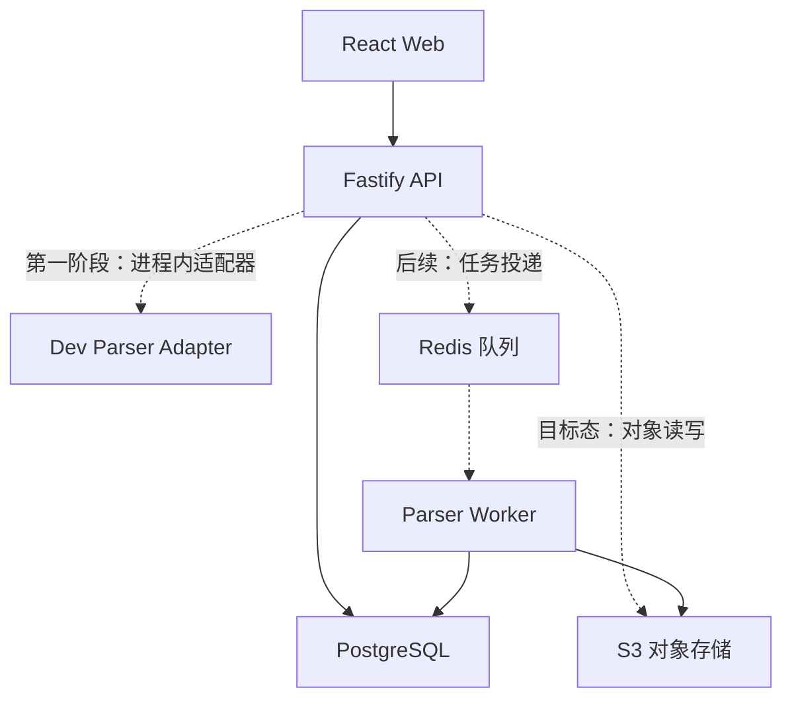
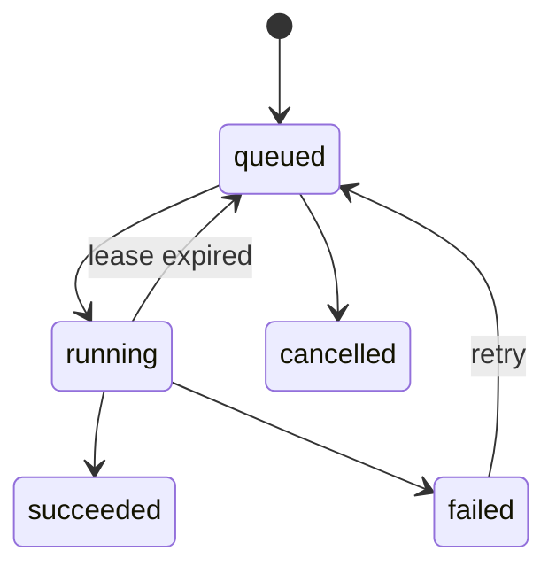

# AiBidV3 MVP 技术方案

> 状态：第一阶段基线  
> 适用范围：MVP 研发、接口评审、部署与验收  
> 最后更新：2026-07-10

## 1. 目标与原则

MVP 的首要目标不是一次性实现完整投标平台，而是将现有高保真原型逐步替换为可持久化、可追溯、可恢复的真实业务闭环：

```text
创建项目 → 上传招标文件 → 异步解析 → 查看进度 → 提取要求 → 人工确认
```

工程决策遵循以下原则：

1. **先验证高风险能力**：文件解析、原文定位、DOCX 导出和 AI 事实约束先于外围功能。
2. **契约先行**：前后端以 [`api/openapi.yaml`](api/openapi.yaml) 为接口事实来源，Mock 与真实 API 使用相同数据结构。
3. **租户隔离默认开启**：业务表从第一天携带 `tenant_id`，不得依赖前端过滤实现隔离。
4. **异步状态可恢复**：PostgreSQL 保存业务与任务事实；Redis 只承担队列、锁和短期缓存，不作为最终状态来源。
5. **开发适配器可替换**：第一阶段 API 进程内的开发解析器和后续独立解析 worker 收敛到同一解析端口契约，避免前端二次改造。
6. **可观测、可审计**：关键状态变更带请求、用户、租户和任务关联标识。

## 2. 范围

### 2.1 第一阶段交付

- Node.js 24 LTS、Fastify 5、TypeScript 后端工程骨架。
- 项目、文件、解析任务、提取要求的 API 契约。
- PostgreSQL、Redis、S3 兼容对象存储的本地开发编排；Redis 与 S3 在第一阶段仅启动并固定边界，API 尚未接入。
- API 进程内开发解析适配器，用确定性 Mock 结果跑通纵向切片。
- 任务进度、失败、人工重试所需的状态模型与错误格式。
- 前后端构建、类型检查、测试的 CI 工作目录约定。

第一阶段不声称具备生产解析能力。开发解析适配器只能用于接口联调和流程验证。为缩短纵向切片，当前 PostgreSQL 实现暂把最大 25 MiB 的上传内容保存为 `project_files.content bytea`；这是本机开发过渡方案，禁止用于共享环境或生产环境，下一阶段必须迁移到 S3 对象键。

### 2.2 后续 MVP

- 独立解析 worker 与持久任务队列。
- PDF/DOCX 真实解析、版面结构识别和稳定原文定位。
- 响应矩阵、目录规划、AI 写作、评审与正式 DOCX 导出。
- 企业级身份源、项目级授权、审计查询、配额与限流。

### 2.3 非目标

- 第一阶段不实现知识库、模板中心、复杂审批、多人实时协同。
- 不在 API 请求生命周期内执行真实的大文件解析或模型推理。
- 不把本地开发凭据、生产密钥、用户文件或解析产物提交到 Git。
- 不以 Redis、浏览器 `localStorage` 或对象存储元数据替代业务数据库。

## 3. 技术基线

| 层级 | 基线 | 说明 |
|---|---|---|
| Web | React + TypeScript + Vite | 当前高保真原型位于 `frontend/` |
| API | Node.js 24 LTS + Fastify 5 + TypeScript | REST、校验、鉴权上下文、业务编排 |
| 关系数据 | PostgreSQL 16 | 业务事实、任务状态、审计与事务 |
| 队列/缓存 | Redis 7 | 后续持久任务队列、分布式锁、短期缓存 |
| 文件存储 | S3 兼容对象存储（目标态） | 本地使用 MinIO；第一阶段 API 尚未接入，生产可替换为云对象存储 |
| 接口契约 | OpenAPI 3.1 | camelCase JSON；成功响应统一 `{ "data": ... }` |
| 错误协议 | RFC 7807 | `application/problem+json` |
| 本地编排 | Docker Compose | 配置位于 `deploy/`，构建上下文指向 `../backend` |

## 4. 总体架构



### 4.1 模块边界

- **Web**：交互、乐观状态和轮询展示；不持有权限判断或解析事实。
- **API**：身份与租户上下文、输入校验、项目授权、事务和资源编排；HTTP 幂等在阶段 B 接入。
- **Parser Port**：接收文件版本，产出结构化要求和 locator；不直接依赖 HTTP 层。
- **Dev Parser Adapter**：在 API 进程内模拟延迟和固定结果，只用于开发。
- **Parser Worker**：后续独立进程，从 Redis 队列取任务，读取 S3 原件并写入 PostgreSQL。
- **PostgreSQL**：业务与任务的唯一事实来源。
- **S3（目标态）**：原始文件、标准化中间件、解析产物和导出文件；数据库仅保存对象键及元数据。

当前实现的文件字节路径是 `API → PostgreSQL bytea → Dev Parser Adapter`。该路径仅为本地纵向切片服务，不是目标架构；MinIO 在 Compose 中启动但未被 API 消费。

当前代码已把开发解析逻辑封装为独立适配器。S3 接入时应将适配器与真实 worker 收敛到以下目标输入/输出契约：

```ts
interface ParserPort {
  enqueue(input: {
    tenantId: string;
    projectId: string;
    fileId: string;
    taskId: string;
    objectKey: string;
    contentType: string;
  }): Promise<void>;
}
```

## 5. 仓库与运行边界

```text
AiBidV3/
├── frontend/              # React Web
├── backend/               # Fastify API；后续可增加 worker 入口
├── deploy/                # 本地编排和环境变量示例
├── docs/
│   ├── api/openapi.yaml   # API 契约
│   └── MVP_TECHNICAL_DESIGN.md
└── README.md
```

从仓库根目录执行应用命令时应显式指定工作目录；不要把依赖安装回根目录。

| 工作项 | 工作目录 | 产物/检查 |
|---|---|---|
| 前端依赖与构建 | `frontend/` | `frontend/dist/` |
| 前端类型/测试 | `frontend/` | typecheck、lint、test |
| 后端依赖与构建 | `backend/` | `backend/dist/` |
| 后端类型/测试 | `backend/` | typecheck、lint、test |
| 本地基础设施 | `deploy/` | `docker compose ...` |

## 6. 数据模型

以下为目标逻辑模型；第一阶段可只落地纵向切片需要的字段，但不得破坏租户键和外键方向。当前 `project_files.content bytea` 是有明确退出条件的临时字段，不属于目标模型。

| 实体 | 关键字段 | 约束与用途 |
|---|---|---|
| `tenants` | `id`, `name`, `status` | 企业租户 |
| `users` | `id`, `external_subject`, `display_name` | 全局身份，不直接决定业务权限 |
| `tenant_memberships` | `tenant_id`, `user_id`, `role` | 租户级成员与角色 |
| `projects` | `id`, `tenant_id`, `name`, `status`, `created_by` | 投标项目 |
| `project_members` | `tenant_id`, `project_id`, `user_id`, `role` | 项目级授权 |
| `files` | `id`, `tenant_id`, `project_id`, `object_key`, `sha256`, `media_type`, `size_bytes`, `status`, `version` | 文件元数据和不可变版本 |
| `tasks` | `id`, `tenant_id`, `project_id`, `file_id`, `type`, `status`, `progress`, `attempt`, `error_code` | 异步任务事实 |
| `requirements` | `id`, `tenant_id`, `project_id`, `file_id`, `content`, `category`, `locator`, `confirmation_status` | 从文件提取并由人确认的要求 |
| `audit_events` | `id`, `tenant_id`, `actor_id`, `action`, `resource_type`, `resource_id`, `occurred_at` | 安全与业务审计 |

### 6.1 通用约束

- 所有业务主键使用 ULID；API 路径参数按 26 位 Crockford Base32 校验。
- 所有租户业务表包含 `tenant_id`；唯一键和外键应优先包含 `tenant_id`。
- 时间统一存储 UTC，API 使用 RFC 3339 字符串。
- **目标态**文件内容不得写入数据库；原件上传后不可原位覆盖，新内容创建新文件版本。
- **第一阶段例外**仅允许本地开发的 `project_files.content bytea`，受服务端 25 MiB 上限约束，禁止用于共享/测试/生产环境。
- 软删除字段不代替审计；删除需同时制定 S3 保留和延迟清理策略。
- 对 `projects(tenant_id, updated_at)`、`files(tenant_id, project_id)`、`tasks(tenant_id, project_id, created_at)`、`requirements(tenant_id, project_id)` 建立索引。

### 6.2 租户与权限边界

请求上下文由认证层生成：

```ts
type RequestContext = {
  requestId: string;
  tenantId: string;
  userId: string;
  tenantRole: "owner" | "admin" | "member" | "viewer";
};
```

生产环境的 `tenantId` 和 `userId` 必须来自已验证的令牌/会话，不接受请求体、查询参数或自定义请求头覆盖。当前开发环境使用 `DEV_TENANT_ID`，并允许 `x-tenant-id` 请求头覆盖以测试隔离；这不是认证，生产部署前必须移除。仓储接口始终强制传入 `tenantId`。

授权顺序固定为：

1. 验证身份和租户成员关系。
2. 以 `tenant_id + resource_id` 查询资源；跨租户资源统一返回 `404`，避免枚举。
3. 检查租户角色和项目角色是否允许动作。
4. 记录高价值写操作审计事件。

最低角色建议：

| 动作 | viewer | member | reviewer | projectAdmin |
|---|---:|---:|---:|---:|
| 查看项目/文件/要求 | ✓ | ✓ | ✓ | ✓ |
| 上传文件/发起解析 |  | ✓ | ✓ | ✓ |
| 确认要求 |  | ✓ | ✓ | ✓ |
| 审批与关闭阻断项 |  |  | ✓ | ✓ |
| 管理项目成员/删除项目 |  |  |  | ✓ |

第一阶段即使暂未接入完整身份源，也必须在领域服务与仓储方法中保留租户参数，避免未来补做高风险数据迁移。

## 7. 文件与对象存储

本节描述下一阶段目标态。当前实现暂存 PostgreSQL `bytea`，MinIO 尚未接入 API。

推荐对象键：

```text
tenants/{tenantId}/projects/{projectId}/files/{fileId}/v{version}/original
tenants/{tenantId}/projects/{projectId}/files/{fileId}/v{version}/normalized/{artifact}
tenants/{tenantId}/projects/{projectId}/exports/{exportId}/{filename}
```

- Bucket 默认私有；浏览器不直接使用永久凭据。
- 上传可在第一阶段经 API multipart 转发，后续大文件切换为短期预签名分片上传。
- 下载通过短期预签名 URL 或鉴权流式接口；日志不得记录签名查询参数。
- 上传时校验扩展名、MIME、文件头和大小；计算 SHA-256 用于幂等与审计，不能只信任客户端元数据。
- 对象写入和数据库提交不是同一事务，需使用 `uploading → ready/failed` 状态和孤儿对象回收任务。
- 生产环境启用服务端加密、版本控制、生命周期、恶意文件扫描和访问日志。

从临时 `bytea` 迁移到 S3 的顺序：

1. 增加 `object_key`、`object_version` 和对象写入状态字段，保留 `sha256`。
2. 新上传先写 S3，再以事务保存元数据和任务；失败对象进入回收清单。
3. 将本地存量字节写入对象存储并用 SHA-256 复核。
4. 读路径切换到 S3，完成回归后把 `content` 改为可空。
5. 删除 `content` 列前完成备份、回滚演练和数据完整性报告。

## 8. 解析任务模型

### 8.1 状态机

第一阶段实现 `queued`、`running`、`succeeded`、`failed` 及失败任务人工重试。下图是接入真实 worker 后的目标状态机，额外包含取消和租约过期恢复。



| 状态 | 含义 | 允许动作 |
|---|---|---|
| `queued` | 已持久化，等待执行 | 取消；worker 领取 |
| `running` | 已领取并持有租约 | 更新进度；成功；失败 |
| `succeeded` | 结果已在同一事务内提交 | 只读；需重跑时创建新任务 |
| `failed` | 当前尝试失败，保留错误码 | 调用重试接口回到 `queued` |
| `cancelled` | 用户或系统终止 | 只读 |

### 8.2 一致性与重试

- `POST /api/v1/projects/{projectId}/files` 成功保存文件元数据和任务后返回 `202 Accepted`，响应包含 `file` 与 `task`。
- PostgreSQL 中的 `tasks.status` 是事实；真实 worker 阶段的队列消息只包含任务 ID 和路由信息。
- 真实 worker 阶段使用任务租约；worker 崩溃后由回收器把超时任务从 `running` 恢复为 `queued`。
- 进度为 0–100 的提示值，不参与正确性判断；终态 `succeeded` 固定为 100。
- 真实 worker 阶段的自动重试只覆盖瞬态错误，例如对象存储超时、限流、worker 中断。文件损坏、格式不支持等永久错误直接失败。
- 当前开发切片由 `POST /api/v1/tasks/{taskId}/retry` 对失败任务执行人工重试；非失败任务拒绝重试。
- 真实 worker 阶段增加 `attempt`、最大次数与错误历史；达到上限后需人工处置或重新上传。
- 解析结果写入与 `succeeded` 状态更新在同一数据库事务内完成。
- 幂等键建议为 `tenantId + fileId + parserVersion + sourceSha256`；重复消费不得重复创建要求。

### 8.3 第一阶段与真实 worker 的切换

第一阶段开发适配器在 API 进程内延迟执行，已经创建真实任务记录并遵守同一基础状态机；模拟结果不会直接拼进上传 HTTP 响应。进入独立 worker 前必须把调用边界收敛到 `ParserPort`。

当前 PostgreSQL 模式在单实例启动时会把遗留的 `running` 任务恢复为 `queued`，并重新提交进程内处理器；同一进程会抑制任务重复入队。这只解决本地重启恢复，不提供多实例抢占、租约、心跳或 exactly-once 保证。

后续切换流程：

1. API 在数据库事务内创建文件、任务和 outbox 事件。
2. relay 将 outbox 事件投递到 Redis 持久队列。
3. worker 根据任务 ID 再次读取租户、文件和对象键。
4. worker 提取文本、要求及 locator，事务写入结果并更新任务。
5. Web 先轮询任务接口；规模需要时再增加 SSE/WebSocket，API 资源模型不变。

## 9. 原文定位（locator）

每条自动提取的要求必须携带可机器校验、可人工回看的来源定位。只保存页码或引用文本都不够稳定。

当前开发适配器只返回 `kind=development-fixture`、`pageNumber=null` 的演示定位器，明确不代表真实原文证据，客户端不得渲染为“已验证引用”。以下结构是阶段 C 真实解析器的目标 locator。

通用结构：

```json
{
  "version": 1,
  "sourceFileId": "file_01...",
  "sourceRevision": 1,
  "kind": "pdf",
  "quote": "投标人应提供近三年同类项目业绩证明",
  "quoteSha256": "...",
  "page": 12,
  "bbox": { "x": 0.08, "y": 0.31, "width": 0.72, "height": 0.05 },
  "textStart": 438,
  "textEnd": 458,
  "parserVersion": "parser/0.1.0"
}
```

字段约束：

- `version`：locator schema 版本，便于未来迁移。
- `sourceFileId + sourceRevision`：绑定不可变源版本。
- `quote + quoteSha256`：用于内容校验和降级搜索，日志只记录哈希或截断文本。
- PDF 使用 1-based `page` 和 0–1 归一化 `bbox`，坐标原点固定为页面左上角。
- DOCX 优先保存稳定段落标识、表格/单元格路径和段内字符范围；同时保存规范化文本偏移作降级。
- `parserVersion`：支持重现与回归对比。

定位分三级验收：

1. **精确命中**：页面/段落与范围仍匹配哈希，直接高亮。
2. **降级命中**：结构标识失效，用 quote 在相邻页面或段落搜索，并标记“已重新定位”。
3. **无法定位**：仍显示引用文本和来源文件，禁止伪造高亮，提示人工核验。

## 10. API 约定

详细契约见 [`api/openapi.yaml`](api/openapi.yaml)。核心约定：

- 路径前缀 `/api/v1`，JSON 字段使用 `camelCase`。
- 成功响应使用 `{ "data": ... }`；创建资源返回 `201`，异步上传/解析返回 `202`。
- 错误使用 RFC 7807 `application/problem+json`，至少包含 `type`、`title`、`status`、`detail`、`instance`、`requestId`、`code`。
- 第一阶段列表直接返回数组。阶段 B 数据规模扩大后改为稳定游标并返回 `nextCursor`，禁止以后端数组下标作为游标。
- 第一阶段尚未实现 HTTP 幂等键。阶段 B 写接口增加 `Idempotency-Key`；同一租户内相同键和相同请求返回同一结果，载荷不同则返回 `409`。
- 客户端以任务资源轮询状态，不从 HTTP 超时推断解析失败。

## 11. 安全与隐私

- 生产凭据由密钥管理服务或部署平台注入；`.env` 仅用于本地且被 Git 忽略。
- 目标态的认证、授权、输入验证和租户过滤均在服务端完成；第一阶段仅有开发租户上下文，没有生产级认证授权。
- 限制上传大小、文件类型、解压层级和解析耗时，防止 zip bomb 与资源耗尽。
- 模型供应商调用前执行数据分级；敏感招标材料不得默认用于训练，需明确数据保留协议。
- 日志禁止记录 Authorization、Cookie、预签名 URL、原始文件内容和完整提取正文。
- 对文件下载、要求确认、AI 内容采用和正式导出记录审计事件。
- 依赖锁文件、容器镜像和基础镜像应固定版本并纳入漏洞扫描。

## 12. 可观测性

所有服务使用结构化 JSON 日志并传播以下字段：

- `requestId`, `traceId`
- `tenantId`, `userId`（必要时哈希/脱敏）
- `projectId`, `fileId`, `taskId`
- `operation`, `durationMs`, `statusCode`, `errorCode`

最低指标：

- API 请求量、P50/P95/P99 延迟、4xx/5xx 比例。
- 上传大小和耗时、失败原因。
- 任务排队时长、执行时长、成功率、重试次数、积压量。
- parser 版本对应的要求提取数量、定位成功率和人工修订率。
- PostgreSQL 连接池、慢查询；Redis 队列延迟；对象存储错误率。

第一阶段 `/health` 检查 API 与当前仓储。目标态应拆分存活与就绪：存活只判断进程；就绪检查当前请求路径必须依赖的数据库和对象存储。不要因 Redis 暂不可用而阻断仅查询类接口，具体由依赖降级策略决定。

## 13. 测试与 CI

### 13.1 测试层级

- **单元测试**：领域状态机、授权矩阵、locator 校验、错误映射。
- **契约测试**：根据 OpenAPI 验证请求/响应；前端 Mock 与后端 fixture 共用样例。
- **集成测试**：第一阶段使用 PostgreSQL 验证上传、任务状态、事务和租户隔离；阶段 B 增加 S3 兼容服务。
- **端到端测试**：覆盖创建项目 → 上传 → 轮询 → 查看要求 → 确认要求。
- **解析基准集**：脱敏 PDF/DOCX 样本，记录提取准确率、locator 命中率和性能预算。

### 13.2 CI 工作目录

CI 必须按变更路径触发，同时保留契约变更的交叉检查：

```text
frontend/**  → working-directory: frontend
backend/**   → working-directory: backend
deploy/**    → docker compose -f deploy/docker-compose.yml config
docs/api/**  → OpenAPI lint + 前后端契约检查
```

建议门禁：

1. 前后端分别执行 lockfile 安装、类型检查、lint、测试、生产构建。
2. 校验 OpenAPI YAML 可解析且 operationId 唯一。
3. 校验 Compose 配置可展开，镜像构建上下文必须为 `../backend`。
4. 禁止提交 `.env`、私钥、访问密钥和大体积测试原件。
5. 数据库迁移在临时 PostgreSQL 上完成 up migration；生产不自动执行破坏性迁移。

## 14. 分阶段计划与验收

### 阶段 A：工程基线（当前）

- 后端骨架、OpenAPI、Compose、环境变量说明、CI 门禁。
- 使用内存仓储可启动；PostgreSQL 仓储提供本地持久化。文件字节临时保存于 `bytea`，MinIO/Redis 尚未被 API 使用。

验收：前后端构建测试通过；Compose 配置有效；API 健康检查可用；仓库无真实密钥。

### 阶段 B：真实持久化纵向切片

- 项目、文件、任务、要求落 PostgreSQL。
- 文件原件落 S3 兼容对象存储。
- 开发解析适配器按任务状态机产出确定性要求。
- 前端核心页面从 Mock 切换到 API，刷新后数据仍存在。

验收：创建项目 → 上传 → 查看进度 → 查看/确认要求全链路通过；失败和人工重试可演示；跨租户访问被拒绝。

### 阶段 C：真实解析 worker

- Redis 持久队列、outbox、租约、重试和死信处置。
- PDF/DOCX 解析与原文查看器，locator 可高亮。
- 基准样本、容量和故障恢复测试。

验收：API 重启不丢任务；worker 重启可恢复；每条要求可回到原文；永久错误与瞬态错误正确分流。

### 阶段 D：响应矩阵到导出

- 响应矩阵、目录冻结、AI 写作、合规评审、DOCX 渲染依次接入。
- AI 输出保存证据引用、模型与提示版本；无依据内容进入阻断或人工确认。

验收：使用真实模板导出可交付 DOCX；阻断项未关闭时不能正式导出；结果可追溯至来源与操作者。

## 15. 优先风险验证

| 风险 | 最小验证 | 退出标准 |
|---|---|---|
| PDF/DOCX 解析差异大 | 选取扫描 PDF、文本 PDF、复杂表格 DOCX 各类脱敏样本 | 关键要求召回率和 locator 命中率达到团队设定阈值 |
| 原文定位随解析器变化漂移 | 固定 parser 版本与 locator schema，做跨版本回归 | 无法精确命中时可安全降级且不错误高亮 |
| Word 模板导出失真 | 先做标题、表格、页眉页脚、目录的渲染 spike | 目标 Office/WPS 版本人工验收通过 |
| AI 产生无依据内容 | 要求引用 source locator，生成后做证据覆盖检查 | 无引用的关键事实默认阻断或标记人工确认 |
| 大文件阻塞 API | 用 25 MB 上限做并发上传和解析压测 | 上传和任务提交在预算内，真实解析不占用 API 事件循环 |
| 跨租户数据泄露 | 仓储级 tenant 参数、负向集成测试 | 所有资源端点均通过跨租户测试 |

## 16. 待确认决策

在进入真实 worker 前需要完成并记录 ADR：

- Redis 队列实现（BullMQ 或其他）及其消息保留/死信策略。
- 身份提供方及租户切换方式。
- PDF/DOCX 解析器、OCR 服务和数据出境边界。
- 对象存储直传、病毒扫描和保留周期。
- DOCX 渲染引擎及模板兼容范围。
- 解析准确率、原文定位命中率与端到端性能的量化 SLO。
