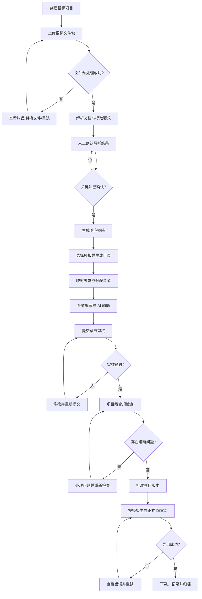

# AiBidV3 企业版 AI 投标书软件产品设计方案

> 文档版本：v0.1
>
> 文档状态：需求基线
>
> 适用产品：企业版 Web 端
>
> 核心范围：从招标文件导入到投标书正式导出
>
> 更新时间：2026-07-10

---

## 0. 结论与产品定义

AiBidV3 不是一个单纯的“AI 写作聊天框”，而是一套面向企业投标业务的结构化协作系统。产品应围绕以下闭环建设：

```text
招标文件导入
→ 智能解析与人工确认
→ 要求 / 评分 / 资质响应矩阵
→ 投标书目录规划与要求映射
→ 多人分工和 AI 辅助写作
→ 合规检查、评审、定稿
→ 按企业模板导出正式投标书
```

产品的核心价值不只是“生成得快”，而是同时实现：

1. **不漏项**：招标要求、评分项、废标项和资质项可跟踪、可验证。
2. **有依据**：AI 内容基于招标文件和企业知识资料生成，并保留来源。
3. **可协作**：项目经理、编写人、审核人围绕章节和要求协同工作。
4. **可治理**：具备企业级权限隔离、操作审计、版本记录和模型配置。
5. **能交付**：最终可按指定模板生成可编辑、可复核的 DOCX 投标书。

MVP 必须完成端到端闭环，不应优先投入实时多人同屏编辑、复杂工作流引擎、自动报价或自动电子投标等高复杂度能力。

---

# 1. 背景与目标

## 1.1 业务背景

企业投标书编制通常存在以下问题：

- 招标文件数量多、格式复杂，人工阅读和归纳耗时。
- 评分项、资格条件、无效投标条款分散在不同章节，容易漏项。
- 公司介绍、资质、案例、人员简历、方案素材重复编写，复用效率低。
- 多人协作依赖即时通信和离线文件，版本冲突、责任不清。
- 章节内容与招标要求缺少显式映射，审核依赖个人经验。
- AI 工具生成内容容易出现事实错误、虚构参数、上下文错配和不可追溯问题。
- 投标书模板、目录编号、页眉页脚、表格和附件整理工作机械且容易出错。
- 招标文件和企业材料包含敏感信息，公共 AI 工具难以满足企业安全要求。

## 1.2 产品定位

面向企业售前、投标和交付团队的 **AI 投标书全流程协作平台**，通过结构化解析、知识增强生成、流程协同、合规检查和模板化导出，提高投标书产出效率与质量。

## 1.3 产品目标

### G1：建立端到端业务闭环

支持从招标文件上传、解析、确认、规划、编写、审核到导出的完整流程，避免在多个工具之间反复切换。

### G2：降低要求漏项风险

将招标要求转化为可跟踪的响应矩阵，确保关键要求均有责任人、响应章节和审核结论。

### G3：提升内容生产和复用效率

基于企业知识库、历史案例和招标上下文生成章节初稿，并支持改写、扩写、压缩、表格化和定向校验。

### G4：满足企业协同与治理要求

具备租户隔离、项目权限、知识权限、版本记录、操作审计、模型策略和数据留存控制。

### G5：输出可正式交付的文档

投标书能够按企业模板生成结构完整、格式可控、可继续编辑的 DOCX 文件。

## 1.4 建议的成功指标

以下指标用于试点复盘，不作为对任意招标文件的绝对承诺：

| 指标 | 目标 |
|---|---:|
| 从文件导入到生成首版目录的耗时 | 相比人工基线降低 70% 以上 |
| 人工标注的关键要求提取召回率 | ≥ 90% |
| 已确认关键要求的章节映射率 | 100% |
| 正式导出前未响应的强制项 | 0 |
| 企业标准素材复用率 | ≥ 50% |
| AI 生成内容可追溯率 | 100% |
| DOCX 文件可正常打开率 | 100% |
| 跨租户越权访问 | 0 |

## 1.5 产品原则

1. **先结构化、后生成**：先识别要求和评分点，再生成目录和正文。
2. **人机协同，不自动定稿**：AI 结果默认是草稿，关键结论必须人工确认。
3. **事实优先于文采**：没有可靠资料时，系统应提示缺少依据，不得默认编造。
4. **来源可追溯**：重要内容应可定位到招标原文、知识材料或人工输入。
5. **正式导出有门禁**：未通过关键合规检查时，不允许生成“正式版”。
6. **最小权限**：组织管理权限不等于项目内容访问权限。
7. **异步可恢复**：解析、生成和导出等长任务均应支持进度、失败重试和错误定位。

## 1.6 非目标

MVP 不包含：

- 自动完成投标报价、成本测算和商务决策。
- 自动登录第三方电子招投标平台并提交文件。
- CA 证书、电子签章、加密锁和投标文件加密。
- 无人工确认的全自动投标书生成。
- 通用 OA、CRM、项目管理或合同管理能力。
- Google Docs 级别的实时多人光标协同。
- 自定义 BPMN 工作流设计器。
- 对任意复杂模板的零配置、像素级还原。

---

# 2. 用户角色

产品采用“企业级角色 + 项目级角色”的两层授权模型，同一用户可同时拥有多个角色。

| 角色 | 层级 | 核心职责 | 默认数据范围 |
|---|---|---|---|
| 企业管理员 | 企业 | 管理组织、用户、角色、模型配置、安全策略和审计策略 | 管理配置；默认不自动获得全部项目正文访问权 |
| 知识库管理员 | 企业/知识空间 | 上传、分类、审核、更新和停用企业资料 | 被授权的知识空间 |
| 模板管理员 | 企业 | 管理投标书模板、样式、封面和导出规则 | 模板中心 |
| 项目负责人 | 项目 | 创建项目、确认解析结果、规划目录、分派任务、发起评审、批准导出 | 所负责项目全部内容 |
| 章节编写人 | 项目/章节 | 编写被分派章节、调用 AI、引用资料、响应修改意见 | 被授权项目及章节；可读取必要上下文 |
| 审核人 | 项目/章节 | 审核要求覆盖、内容准确性、格式和合规性，提出或关闭问题 | 被授权项目；原则上不直接覆盖作者正文 |
| 项目查看者 | 项目 | 只读查看项目、进度和投标书内容 | 被授权项目只读 |
| 审计员 | 企业/项目 | 查看操作日志、导出记录、模型调用记录和版本信息 | 被授权审计范围，只读 |

## 2.1 关键约束

- 企业管理员不应因为拥有“用户管理”权限而天然读取所有保密项目内容。
- 审核人提出修改意见后，由编写人修改；确需直接修改时必须保留变更记录。
- 知识库管理员可维护知识资料，但不自动获得投标项目访问权限。
- 项目负责人可以重新打开已批准章节，但必须填写原因并生成新的版本记录。
- 正式导出权限与普通查看、草稿导出权限分离。

---

# 3. 核心场景

## S1：创建投标项目

项目负责人录入项目名称、项目编号、招标人、截止时间、标包和保密等级，选择投标书模板、默认模型配置和项目成员。

**产出**：投标项目、项目成员、初始里程碑和项目空间。

## S2：导入招标文件包

用户上传 PDF、DOC/DOCX、XLS/XLSX 或 ZIP 文件包。系统完成文件查毒、解压、分类、文本提取和必要的 OCR 处理。

**产出**：文件清单、文件分类、解析任务和异常提示。

## S3：智能解析与人工确认

系统识别项目元数据、投标截止时间、评分办法、资格条件、技术要求、商务要求、格式要求、无效投标条款和附件清单。用户逐项查看原文定位、置信度和识别结果，并进行确认、修正或合并。

**产出**：经人工确认的招标分析结果。

## S4：建立响应矩阵

系统将招标要求转换为结构化条目，每条要求包含来源、类型、强制级别、分值、责任人、响应方式、目标章节、完成状态和风险等级。

**产出**：可跟踪、可筛选、可审核的要求响应矩阵。

## S5：生成并规划投标书目录

项目负责人选择企业模板，系统结合评分项、招标目录和企业章节模板生成建议目录，并自动建立“要求 → 章节”映射。用户可以调整层级、顺序、负责人、审核人和目标篇幅。

**产出**：投标书目录树、章节任务和要求映射。

## S6：AI 辅助章节写作

编写人在三栏式写作工作台中查看目录、编辑正文，并调用 AI 进行初稿生成、扩写、压缩、改写、表格化、风格统一和定向回答。AI 上下文由招标要求、相邻章节摘要、企业知识资料和人工说明组成。

**产出**：有来源、有版本、有责任人的章节内容。

## S7：引用企业知识和项目材料

编写人从企业知识库选择公司介绍、资质、案例、人员、产品、解决方案和承诺模板。系统提示资料有效期、保密级别和适用范围，避免引用过期或未授权材料。

**产出**：已引用材料、引用关系和证据链。

## S8：合规检查和评审

系统检查未响应要求、未映射评分项、占位符、名称/日期/金额不一致、无依据表述、敏感词、重复内容和章节状态。审核人按章节或问题单提出修改意见，编写人修改后重新提交。

**产出**：问题清单、审核结论、修改闭环和批准版本。

## S9：生成草稿或正式投标书

用户选择导出模板、封面数据、目录层级、页眉页脚和附件规则。草稿可随时导出并带水印；正式版必须通过导出门禁。

**产出**：可下载的 DOCX 文件、内容快照、模板版本、校验值和导出记录。

## S10：审计和复盘

管理员或审计员查看关键操作、模型调用、知识引用、内容版本、审核记录和导出记录。项目结束后归档为只读，并可将经审核内容沉淀为知识候选材料。

**产出**：完整审计链和可复用知识资产。

---

# 4. MVP 范围

## 4.1 MVP 范围定义

MVP 的完成标准是：一个真实投标项目能够在系统内完成“导入—解析—确认—规划—写作—审核—DOCX 导出”的完整闭环。

### P0：MVP 必须实现

| 模块 | P0 能力 |
|---|---|
| 账号与组织 | 登录、企业租户、用户、基础角色、禁用用户、项目成员管理 |
| 项目管理 | 创建、编辑、复制基础配置、归档、项目看板、截止时间提醒 |
| 文件管理 | 分片上传、断点续传或可恢复上传、ZIP 解压、版本、删除、下载、查毒接口 |
| 文件解析 | PDF/DOCX/XLSX 文本提取；扫描件 OCR 适配；文档结构、页码和原文定位 |
| 招标分析 | 项目元数据、关键日期、评分项、资格项、技术/商务/格式/无效条款提取 |
| 人工确认 | 逐项确认、修正、合并、拆分、忽略、标记低置信度 |
| 响应矩阵 | 要求条目、责任人、目标章节、风险、状态、筛选、批量操作 |
| 目录规划 | 基于模板和要求生成目录；拖拽排序；章节映射；任务分派 |
| 写作工作台 | 富文本编辑、自动保存、章节锁、历史版本、评论、章节状态 |
| AI 辅助 | 初稿、续写、改写、扩写、压缩、表格化、检查；流式输出；取消和重试 |
| 知识库 | 上传、分类、标签、权限、有效期、检索、预览、引用和停用 |
| 来源追溯 | AI 生成记录、招标原文引用、知识资料引用、点击定位 |
| 评审 | 提交审核、修改意见、问题分级、退回、批准、重新打开 |
| 合规检查 | 要求覆盖、未映射项、占位符、一致性、无来源高风险表述、未关闭阻断问题 |
| 导出 | 草稿 DOCX、正式 DOCX、企业模板、目录、编号、页眉页脚、图片与表格 |
| 审计 | 登录、权限、文件、AI 生成、正文修改、审核、导出的关键日志 |
| 任务基础设施 | 解析、生成、索引、导出等任务的排队、进度、超时、重试和错误提示 |

### P1：MVP 后优先增强

- PDF 高保真导出和在线预览。
- OIDC/SAML/LDAP/企业微信/钉钉等统一身份认证。
- 可配置的多级审批流程。
- 多套模型路由、模型降级、成本预算和配额。
- 章节级更细粒度的知识空间授权。
- 批量导入历史投标书并生成知识候选。
- 更强的表格识别、图片说明和跨文档对照。
- 实时消息通知、邮件和企业 IM 通知。
- 投标文件完整性包检查和附件清单检查。

### P2：中长期能力

- 历史中标项目学习和相似项目推荐。
- 评分模拟、竞争策略和投标决策辅助。
- 外部专家、合作伙伴受控协作。
- 报价系统、CRM、项目管理、电子招投标平台集成。
- 电子签章、CA、文件加密和在线投递。

## 4.2 MVP 技术和产品边界

- 正式交付格式以 DOCX 为准；PDF 放在 P1，避免 MVP 被复杂排版引擎拖慢。
- MVP 采用“章节锁 + 自动保存 + 版本历史”，不实现实时多人同段编辑。
- OCR 使用可替换服务适配器，不在本产品内自研 OCR 引擎。
- AI 生成必须经过人工确认；系统不自动将生成内容标记为已批准。
- 模板先支持受控模板规范，不承诺兼容所有历史 Word 文档中的宏、域和复杂浮动布局。

---

# 5. 页面清单

## 5.1 信息架构

```text
登录
└─ 工作台
   ├─ 项目中心
   │  ├─ 项目概览
   │  ├─ 招标文件
   │  ├─ 智能解析
   │  ├─ 响应矩阵
   │  ├─ 目录规划
   │  ├─ 写作工作台
   │  ├─ 评审与合规
   │  ├─ 导出中心
   │  └─ 项目设置
   ├─ 企业知识库
   ├─ 模板中心
   ├─ 任务中心
   └─ 企业管理
      ├─ 组织与用户
      ├─ 角色与权限
      ├─ 模型配置
      ├─ 安全策略
      └─ 审计日志
```

## 5.2 页面明细

| 编号 | 页面 | 建议路由 | 核心内容 | 主要操作 | 优先级 |
|---|---|---|---|---|---|
| P01 | 登录页 | `/login` | 账号登录、企业标识、异常提示 | 登录、找回密码 | P0 |
| P02 | 工作台 | `/workspace` | 待办、临近截止项目、最近项目、任务失败提醒 | 进入项目、处理待办 | P0 |
| P03 | 项目列表 | `/projects` | 项目状态、负责人、截止时间、进度、风险 | 搜索、筛选、新建、归档 | P0 |
| P04 | 新建项目向导 | `/projects/new` | 项目信息、标包、模板、模型、成员 | 保存草稿、创建并上传 | P0 |
| P05 | 项目概览 | `/projects/:id/overview` | 关键日期、进度、要求覆盖、章节状态、风险 | 启动解析、分配任务、发起审核 | P0 |
| P06 | 招标文件 | `/projects/:id/files` | 文件树、类型、版本、解析状态、原文预览 | 上传、替换、分类、重试、下载 | P0 |
| P07 | 智能解析 | `/projects/:id/analysis` | 元数据、日期、评分、资格、无效条款、低置信度项 | 确认、修正、合并、拆分 | P0 |
| P08 | 响应矩阵 | `/projects/:id/requirements` | 要求列表、来源、分值、风险、责任人、映射、状态 | 筛选、批量分配、映射章节、确认 | P0 |
| P09 | 目录规划 | `/projects/:id/outline` | 目录树、要求覆盖、负责人、审核人、目标篇幅 | AI 生成目录、拖拽、合并、映射、冻结 | P0 |
| P10 | 写作工作台 | `/projects/:id/write/:sectionId` | 左侧目录、中间编辑器、右侧 AI/来源/评论 | 编辑、生成、引用、提交审核 | P0 |
| P11 | 资料选择器 | 写作页抽屉/弹窗 | 招标原文、知识资料、项目附件、引用状态 | 搜索、预览、插入、绑定来源 | P0 |
| P12 | 评审与合规 | `/projects/:id/review` | 章节审核、问题单、要求覆盖、自动检查结果 | 退回、批准、关闭问题、重新检查 | P0 |
| P13 | 导出中心 | `/projects/:id/export` | 导出门禁、模板、封面、版本、历史导出 | 生成草稿、生成正式版、下载 | P0 |
| P14 | 项目设置 | `/projects/:id/settings` | 基础信息、成员、权限、模板、模型、归档 | 编辑、加人、移除、归档 | P0 |
| P15 | 企业知识库 | `/knowledge` | 知识空间、分类、资料、有效期、状态 | 上传、审核、授权、停用 | P0 |
| P16 | 模板中心 | `/templates` | 模板、样式规则、封面字段、版本 | 上传、校验、发布、停用 | P0 |
| P17 | 任务中心 | `/tasks` | 解析、索引、生成、导出任务及错误 | 查看详情、取消、重试 | P0 |
| P18 | 组织与用户 | `/admin/users` | 部门、用户、状态、企业角色 | 邀请、禁用、分配角色 | P0 |
| P19 | 角色与权限 | `/admin/roles` | 权限点、角色、数据范围 | 查看、配置自定义角色 | P1 |
| P20 | 模型配置 | `/admin/models` | 模型供应商、端点、模型、限额、用途 | 新增、测试、启停、设默认 | P0 |
| P21 | 安全策略 | `/admin/security` | 密码、会话、文件、数据留存、下载策略 | 配置策略 | P1 |
| P22 | 审计日志 | `/admin/audit` | 操作人、时间、对象、动作、结果、IP | 筛选、查看、受控导出 | P0 |

## 5.3 写作工作台布局

写作工作台采用三栏布局：

- **左栏：目录和任务**
  - 章节树、章节状态、负责人、要求覆盖数、风险提示。
- **中栏：正文编辑器**
  - 标题层级、正文、表格、图片、列表、分页符、引用标记、自动保存状态。
- **右栏：AI 与证据面板**
  - 当前章节要求、招标原文、知识资料、AI 指令、生成历史、评论和检查结果。

关键交互约束：

- AI 生成内容先进入“候选结果”，用户选择插入、替换或放弃。
- 插入正文时同步保存来源引用和生成记录。
- 章节被他人编辑时进入只读或申请接管，避免静默覆盖。
- 离开页面前若自动保存失败，必须明确阻止或提示用户处理。

---

# 6. 用户流程

## 6.1 端到端主流程



## 6.2 招标文件解析流程

1. 用户上传文件或 ZIP 包。
2. 系统校验文件类型、大小、哈希、病毒扫描结果和重复文件。
3. 系统解压并分类为招标正文、技术附件、商务附件、清单、图纸或其他材料。
4. 文本型文件直接提取；扫描文件调用 OCR 服务。
5. 系统保留“页码/工作表/段落/坐标”等原文锚点。
6. AI 识别项目元数据、关键日期、评分项、资格项、强制项和格式要求。
7. 低置信度、冲突或跨文件不一致项进入人工确认队列。
8. 用户确认后生成当前解析基线版本。
9. 替换招标文件时重新解析，并展示新旧要求差异，不直接覆盖已确认结果。

## 6.3 目录与要求映射流程

1. 项目负责人选择企业模板或空白目录。
2. AI 根据评分办法、招标章节和企业模板生成建议目录。
3. 系统尝试将每个已确认要求映射到一个或多个章节。
4. 未映射要求进入待处理队列。
5. 项目负责人调整目录、映射、责任人和审核人。
6. 所有强制要求完成映射后，目录可被冻结为“写作基线”。
7. 冻结后仍可调整，但需记录变更原因并提示受影响章节。

## 6.4 章节编写与审核流程

1. 编写人领取或打开被分配章节。
2. 系统加载章节要求、相关原文、企业资料和相邻章节摘要。
3. 编写人选择“生成初稿”或在已有正文基础上改写。
4. AI 返回候选内容、引用来源和风险提示。
5. 编写人确认后插入正文，继续编辑并解决占位符。
6. 编写人执行章节自检并提交审核。
7. 审核人按问题单提出修改意见，可标记为阻断/重要/一般。
8. 编写人修改并逐条回复，审核人关闭问题或再次退回。
9. 审核通过后章节锁定；重新打开需填写原因。

## 6.5 导出流程和门禁

### 草稿导出

- 有项目查看权限和草稿导出权限即可执行。
- 可在未完成状态下导出。
- 必须带“草稿/未审核”水印，并记录导出人和内容快照。

### 正式导出

必须同时满足：

- 所有强制要求已确认并映射。
- 所有必需章节已审核通过。
- 阻断级问题数量为 0。
- 未替换占位符数量为 0。
- 关键名称、日期、金额和项目编号一致性检查通过，或已人工豁免并说明原因。
- 当前用户拥有“正式导出”权限。
- 当前内容版本已由项目负责人批准。

正式导出必须基于不可变内容快照，导出过程中继续编辑不会影响本次文件。

## 6.6 异常流程

| 异常 | 系统行为 |
|---|---|
| 文件解析失败 | 保留原文件，展示失败阶段、错误码、建议动作，支持重试或替换 |
| OCR 质量低 | 标记低置信度页，允许手工校对或上传更清晰版本 |
| AI 调用超时 | 保留输入快照和任务记录，支持重试，不向正文写入半成品 |
| 模型不可用 | 按配置降级到备用模型；无备用模型时明确失败 |
| 编辑冲突 | 阻止静默覆盖，展示冲突版本并支持对比、复制和重新提交 |
| 知识资料过期 | 默认不参与生成，用户有权限时可临时引用并记录风险 |
| 模板渲染失败 | 返回具体章节、元素和模板规则错误，保留内容快照 |
| 正式导出门禁未通过 | 禁止生成正式版；允许生成带水印草稿 |

---

# 7. 字段与状态

## 7.1 通用字段约定

所有核心业务表建议包含：

| 字段 | 说明 |
|---|---|
| `id` | 全局唯一标识 |
| `tenant_id` | 企业租户标识，作为数据隔离必填条件 |
| `created_at` / `updated_at` | 创建和更新时间 |
| `created_by` / `updated_by` | 创建和更新用户 |
| `version` | 乐观锁版本号，防止并发覆盖 |
| `deleted_at` | 软删除时间；涉及审计的数据不做物理删除 |
| `confidentiality_level` | 普通、内部、机密等数据密级 |

数据库、对象存储、搜索索引、向量索引和任务消息中都必须携带 `tenant_id`，不得仅依赖前端传参过滤。

## 7.2 项目 `BidProject`

| 字段 | 类型/示例 | 必填 | 说明 |
|---|---|---:|---|
| `project_code` | string | 是 | 企业内项目编码 |
| `name` | string | 是 | 项目名称 |
| `tenderer_name` | string | 否 | 招标人/采购人 |
| `agency_name` | string | 否 | 招标代理机构 |
| `tender_no` | string | 否 | 招标编号 |
| `package_no` | string | 否 | 标包编号 |
| `industry` | enum/string | 否 | 行业分类 |
| `region` | string | 否 | 地区 |
| `budget_amount` | decimal | 否 | 预算金额 |
| `currency` | string | 否 | 币种 |
| `bid_deadline` | datetime | 否 | 投标截止时间 |
| `opening_time` | datetime | 否 | 开标时间 |
| `owner_id` | user_id | 是 | 项目负责人 |
| `template_id` | template_id | 否 | 当前导出模板 |
| `model_profile_id` | model_profile_id | 否 | 默认模型配置 |
| `stage` | enum | 是 | 项目业务阶段 |
| `baseline_version` | integer | 是 | 当前项目基线版本 |
| `approved_snapshot_id` | snapshot_id | 否 | 已批准内容快照 |
| `archived_at` | datetime | 否 | 归档时间 |

### 项目阶段

```text
DRAFT 草稿
→ ANALYZING 解析中
→ PLANNING 规划中
→ WRITING 编写中
→ REVIEWING 评审中
→ APPROVED 已批准
→ ARCHIVED 已归档
```

允许的关键回退：

- `ANALYZING → DRAFT`：取消解析或文件不可用。
- `REVIEWING → WRITING`：存在修改意见。
- `APPROVED → WRITING`：重新打开，必须填写原因并使原批准快照失效。
- `ARCHIVED → WRITING`：仅项目负责人或授权管理员可恢复，并记录审计。

解析、生成和导出失败不应直接变更项目业务阶段，由独立任务状态表达。

## 7.3 招标文件 `TenderDocument`

| 字段 | 说明 |
|---|---|
| `project_id` | 所属项目 |
| `category` | 招标正文、技术附件、商务附件、清单、图纸、其他 |
| `file_name` / `extension` / `mime_type` | 文件信息 |
| `size_bytes` | 文件大小 |
| `sha256` | 文件完整性和重复检测 |
| `storage_key` | 对象存储键，不向前端直接暴露 |
| `file_version` | 文件版本 |
| `page_count` | 页数或工作表等效数量 |
| `text_extract_mode` | 原生提取、OCR、混合 |
| `parse_status` | 解析状态 |
| `confidence` | 整体识别置信度 |
| `active` | 是否为当前生效版本 |
| `replaced_document_id` | 被替换的旧文件 |

### 文件解析状态

```text
UPLOADED 已上传
→ PREPROCESSING 预处理中
→ PARSING 解析中
→ NEEDS_CONFIRMATION 待确认
→ READY 可用
```

异常状态：`FAILED`、`CANCELED`。失败后允许回到 `PREPROCESSING` 重试。

## 7.4 解析任务 `ProcessingJob`

适用于文件解析、OCR、知识索引、AI 生成和文档导出。

| 字段 | 说明 |
|---|---|
| `job_type` | PARSE、OCR、INDEX、GENERATE、CHECK、EXPORT |
| `biz_object_type` / `biz_object_id` | 业务对象 |
| `status` | 任务状态 |
| `progress` | 0—100，仅作进度提示 |
| `attempt` / `max_attempts` | 当前重试次数和上限 |
| `started_at` / `finished_at` | 执行时间 |
| `error_code` / `error_message` | 面向支持人员的错误信息 |
| `user_message` | 面向业务用户的可理解提示 |
| `input_snapshot_id` | 不可变输入快照 |
| `worker_trace_id` | 日志追踪标识 |

任务状态：

```text
QUEUED → RUNNING → SUCCEEDED
              ├→ FAILED
              └→ CANCELED
```

## 7.5 招标要求 `TenderRequirement`

| 字段 | 类型/枚举 | 说明 |
|---|---|---|
| `requirement_code` | string | 系统编号或招标原编号 |
| `title` | string | 要求摘要 |
| `original_text` | text | 招标原文 |
| `source_document_id` | id | 来源文件 |
| `source_anchor` | JSON | 页码、段落、单元格或坐标 |
| `type` | enum | 强制、评分、资格、技术、商务、格式、交付、附件、其他 |
| `mandatory_level` | enum | BLOCKER、REQUIRED、OPTIONAL |
| `score_points` | decimal | 分值，无分值时为空 |
| `response_mode` | enum | 正文、表格、承诺函、证明附件、报价、无需响应 |
| `risk_level` | enum | HIGH、MEDIUM、LOW |
| `extract_confidence` | decimal | AI 提取置信度 |
| `confirmation_status` | enum | 未确认、已确认、已忽略 |
| `owner_id` | user_id | 责任人 |
| `mapped_section_ids` | relation | 响应章节，可一对多 |
| `due_at` | datetime | 内部完成时间 |
| `response_status` | enum | 响应状态 |
| `verification_result` | enum | 未检查、通过、警告、失败、人工豁免 |
| `waiver_reason` | text | 豁免原因 |

### 要求响应状态

```text
UNCONFIRMED 未确认
→ CONFIRMED 已确认
→ MAPPED 已映射章节
→ DRAFT_RESPONDED 已有草稿响应
→ REVIEWED 已审核
→ ACCEPTED 已满足
```

特殊状态：

- `IGNORED`：确认不是有效要求，必须记录原因。
- `WAIVED`：确认存在但决定豁免，强制项仅项目负责人可操作，且正式导出时仍显示风险。

## 7.6 投标书目录节点 `OutlineNode`

| 字段 | 说明 |
|---|---|
| `project_id` | 所属项目 |
| `parent_id` | 父节点 |
| `title` | 标题 |
| `level` | 目录层级 |
| `sort_order` | 同级顺序 |
| `node_type` | 章节、附件、封面、目录、分隔页 |
| `source` | AI 生成、模板导入、人工创建 |
| `required` | 是否必须完成 |
| `assignee_id` | 编写人 |
| `reviewer_id` | 审核人 |
| `target_word_count` | 建议篇幅 |
| `mapped_requirement_count` | 映射要求数，建议派生计算 |
| `status` | 章节状态 |
| `frozen` | 是否进入目录基线 |

### 章节状态

```text
NOT_STARTED 未开始
→ DRAFTING 编写中
→ PENDING_REVIEW 待审核
→ APPROVED 已通过
→ LOCKED 已锁定
```

退回路径：`PENDING_REVIEW → CHANGES_REQUIRED → DRAFTING`。

## 7.7 章节内容与版本 `BidSection` / `SectionVersion`

### `BidSection`

| 字段 | 说明 |
|---|---|
| `outline_node_id` | 对应目录节点 |
| `content_json` | 编辑器结构化内容，作为主存储 |
| `plain_text` | 检索和检查用纯文本 |
| `current_version_no` | 当前版本号 |
| `status` | 章节状态 |
| `editing_user_id` / `lock_expires_at` | 章节编辑锁 |
| `last_saved_at` | 最近自动保存时间 |
| `citation_count` | 引用数量 |
| `open_issue_count` | 未关闭问题数 |

### `SectionVersion`

| 字段 | 说明 |
|---|---|
| `section_id` / `version_no` | 章节与版本号 |
| `content_snapshot` | 不可变内容快照 |
| `change_type` | 自动保存、人工保存、AI 插入、提交审核、审核通过、回退 |
| `change_summary` | 变更摘要 |
| `created_by` | 变更人 |
| `generation_task_id` | AI 变更时关联任务 |

## 7.8 企业知识资料 `KnowledgeAsset`

| 字段 | 说明 |
|---|---|
| `space_id` | 知识空间 |
| `category` | 公司介绍、资质、案例、人员、产品、方案、承诺、其他 |
| `title` | 资料标题 |
| `file_id` | 原始文件 |
| `tags` | 行业、区域、产品等标签 |
| `business_scope` | 适用业务范围 |
| `effective_at` / `expires_at` | 有效期 |
| `confidentiality_level` | 密级 |
| `owner_department_id` | 归属部门 |
| `status` | 处理状态 |
| `approval_status` | 知识审核状态 |
| `index_version` | 当前检索索引版本 |

知识状态：

```text
UPLOADED → PROCESSING → PENDING_APPROVAL → AVAILABLE
                    └→ FAILED
AVAILABLE → DISABLED / EXPIRED
```

只有 `AVAILABLE` 且用户有权限的资料才可默认进入 AI 上下文。

## 7.9 AI 生成任务 `GenerationTask`

| 字段 | 说明 |
|---|---|
| `operation` | 初稿、续写、改写、扩写、压缩、表格化、摘要、检查 |
| `target_type` / `target_id` | 目标章节或选区 |
| `model_profile_id` | 模型配置 |
| `model_name` | 实际执行模型 |
| `prompt_template_id` / `prompt_version` | 提示词版本 |
| `input_snapshot` | 用户指令和业务上下文快照 |
| `source_refs` | 招标文件、知识资料和章节引用 |
| `parameters` | 温度、最大输出等受控参数 |
| `status` | 任务状态 |
| `output_snapshot` | 原始输出 |
| `accepted_action` | 插入、替换、复制、放弃 |
| `token_usage` / `estimated_cost` | 用量和成本 |
| `safety_flags` | 安全、敏感或缺少依据提示 |
| `error_code` | 调用失败原因 |

## 7.10 评审问题 `ReviewIssue`

| 字段 | 说明 |
|---|---|
| `project_id` | 所属项目 |
| `target_type` / `target_id` | 项目、章节、要求、具体文本位置 |
| `issue_type` | 漏项、事实、技术、商务、格式、引用、重复、其他 |
| `severity` | BLOCKER、MAJOR、MINOR |
| `title` / `description` | 问题内容 |
| `raised_by` / `assignee_id` | 提出人和处理人 |
| `status` | 问题状态 |
| `resolution` | 解决说明 |
| `resolved_by` / `resolved_at` | 解决信息 |

问题状态：

```text
OPEN → IN_PROGRESS → RESOLVED → VERIFIED → CLOSED
          └──────────────→ REOPENED ─────→ IN_PROGRESS
```

## 7.11 导出任务 `ExportTask`

| 字段 | 说明 |
|---|---|
| `project_id` | 所属项目 |
| `export_type` | DRAFT、FORMAL |
| `format` | MVP 为 DOCX |
| `template_id` / `template_version` | 模板及版本 |
| `content_snapshot_id` | 本次导出的不可变内容快照 |
| `gate_result` | 导出门禁结果 |
| `status` | QUEUED、GENERATING、SUCCEEDED、FAILED、CANCELED |
| `file_storage_key` | 产出文件 |
| `file_sha256` | 文件校验值 |
| `watermark` | 草稿水印信息 |
| `created_by` / `created_at` | 导出人和时间 |
| `download_count` | 下载次数 |
| `expires_at` | 临时下载地址失效时间 |

## 7.12 审计日志 `AuditLog`

关键字段：

- 用户、租户、部门、角色快照。
- 时间、IP、User-Agent、Trace ID。
- 业务对象类型和对象 ID。
- 操作类型、操作结果和失败原因。
- 变更前后摘要；敏感正文不直接写入普通日志。
- AI 模型、提示词版本、知识来源和用量摘要。

必须审计的操作包括：用户和权限变更、文件上传/下载/删除、知识发布、AI 生成、章节批准、正式导出、项目归档和数据删除。

---

# 8. 权限设计

## 8.1 授权模型

采用：

```text
RBAC 企业角色
+ Project ACL 项目成员与项目角色
+ Resource Scope 章节/知识空间/密级数据范围
+ Action Policy 特殊操作策略
```

权限判定至少包含：

```text
用户是否有效
AND 用户属于当前租户
AND 拥有对应功能权限
AND 拥有目标项目/知识空间的数据权限
AND 满足对象状态约束
AND 满足密级、下载和导出策略
```

后端必须执行最终鉴权，前端隐藏按钮不能代替权限控制。

## 8.2 MVP 角色权限矩阵

符号说明：`✓` 允许，`△` 仅限授权范围或需附加条件，`—` 不允许。

| 权限 | 企业管理员 | 知识库管理员 | 项目负责人 | 编写人 | 审核人 | 查看者/审计员 |
|---|:---:|:---:|:---:|:---:|:---:|:---:|
| 管理组织与用户 | ✓ | — | — | — | — | — |
| 配置模型和安全策略 | ✓ | — | — | — | — | — |
| 查看所有项目内容 | — | — | — | — | — | — |
| 创建项目 | △ | — | ✓ | — | — | — |
| 查看项目 | △ | — | ✓ | △ | △ | △ |
| 编辑项目基础信息 | △ | — | ✓ | — | — | — |
| 管理项目成员 | — | — | ✓ | — | — | — |
| 上传/替换招标文件 | — | — | ✓ | △ | — | — |
| 删除招标文件 | — | — | ✓ | — | — | — |
| 确认解析结果 | — | — | ✓ | △ | △ | — |
| 编辑响应矩阵 | — | — | ✓ | △ | △ | — |
| 编辑目录与分工 | — | — | ✓ | — | — | — |
| 编辑章节 | — | — | ✓ | △ | △* | — |
| 调用 AI 生成 | — | — | ✓ | △ | △ | — |
| 提交章节审核 | — | — | ✓ | △ | — | — |
| 提出审核问题 | — | — | ✓ | — | ✓ | — |
| 批准章节 | — | — | ✓ | — | ✓ | — |
| 批准项目正式版本 | — | — | ✓ | — | △ | — |
| 草稿导出 | — | — | ✓ | △ | △ | △** |
| 正式导出 | — | — | ✓ | — | △ | — |
| 管理知识资料 | — | ✓ | — | — | — | — |
| 引用知识资料 | — | △ | ✓ | △ | △ | — |
| 管理导出模板 | △ | — | — | — | — | — |
| 查看审计日志 | ✓ | — | △ | — | — | △ |
| 归档/恢复项目 | — | — | ✓ | — | — | — |

说明：

- `△*`：审核人默认仅评论；若被授予“直接修订”权限，可以编辑，但必须自动记录为审核修订。
- `△**`：查看者是否允许草稿导出由项目策略决定，默认关闭。
- 企业管理员需要被显式加入项目后才能读取项目正文；紧急数据管理员访问必须触发审计和通知。

## 8.3 权限点建议

后端权限码建议按资源和动作命名：

```text
project:create
project:read
project:update
project:manage_member
project:archive
file:upload
file:replace
file:delete
analysis:confirm
requirement:update
outline:update
section:read
section:update
section:generate
section:submit_review
review:create_issue
review:approve_section
project:approve
export:draft
export:formal
knowledge:manage
knowledge:read
model:manage
template:manage
audit:read
```

## 8.4 敏感操作控制

- 正式导出、权限变更、模型密钥变更、知识发布和项目恢复应二次确认。
- 模型 API Key 仅后端可解密，前端只显示掩码。
- 下载链接应短时有效并绑定用户；高密级项目可禁用浏览器直接下载。
- 导出文件可选嵌入导出人、时间和项目标识水印。
- 删除操作优先软删除；正式导出记录和审计日志不可由普通管理员删除。
- 所有越权访问返回统一的 403，不泄露对象是否存在。

---

# 9. AI 能力设计

## 9.1 AI 上下文组成

每次生成按最小必要原则组装上下文：

1. 当前章节标题、写作目标和用户指令。
2. 映射到当前章节的招标要求及原文。
3. 用户主动选择或系统召回的企业知识资料。
4. 已批准的前置章节摘要和术语表。
5. 项目元数据、统一名称、日期、金额和格式规则。
6. 输出格式、篇幅、语气和禁止编造规则。

不应默认将整个项目所有文件全部发送给模型，避免成本、上下文污染和敏感数据过度暴露。

## 9.2 生成结果要求

AI 输出至少包含：

- 候选正文。
- 所使用的来源列表。
- 无可靠依据的待确认项。
- 可能冲突或风险提示。
- 实际模型、提示词版本、时间和生成任务 ID。

## 9.3 防止幻觉的产品机制

- 缺少企业资料时使用明确占位符，如 `【待补充：近三年类似案例】`，不得虚构。
- 数字、证书编号、人员姓名、案例名称等事实字段优先从结构化资料读取。
- 未被来源支持的事实性句子在检查中标记为高风险。
- 生成温度和模型参数由管理员按用途配置，普通用户不可任意提高。
- 正式导出前执行占位符和无来源事实检查。
- 对低置信度解析结果，不自动参与正式正文生成，除非用户确认。

## 9.4 模型配置

模型配置至少包含：

- 供应商、模型名、基础 URL、认证密钥引用。
- 用途：解析、写作、检查、向量化、OCR。
- 最大上下文、最大输出、超时、重试、并发和每日预算。
- 数据是否出境、是否保留、是否用于训练等合规标签。
- 主模型、备用模型和熔断策略。

---

# 10. 非功能与安全要求

## 10.1 安全

- 全链路 HTTPS；服务间敏感通信采用受控身份认证。
- 对象存储私有桶，禁止长期公开 URL。
- 数据库敏感字段和模型密钥加密存储。
- 租户隔离需覆盖数据库查询、缓存、检索索引、向量库、对象存储和任务队列。
- 上传文件执行扩展名、MIME、大小、压缩炸弹和病毒检查。
- 富文本进行 XSS 清洗；导出模板禁止执行宏和不受信脚本。
- 权限、下载、正式导出和管理员操作纳入审计。
- 支持配置数据留存期限、项目归档和安全删除流程。

## 10.2 可用性与恢复

- 长任务异步执行，页面刷新或重新登录后仍可查看进度。
- 任务幂等，重复点击不会产生多份不可控结果。
- 自动保存失败有明确提示和本地临时恢复机制。
- 生成、解析和导出支持有限次数的安全重试。
- 关键内容保存采用乐观锁或编辑锁，禁止静默覆盖。
- 数据库和对象存储具备备份和恢复方案；正式上线前完成恢复演练。

## 10.3 性能目标

以下为 MVP 建议目标，需在选定部署规格和模型服务后压测确认：

| 场景 | 目标 |
|---|---:|
| 普通页面接口 P95 | ≤ 1.5 秒 |
| 项目列表和响应矩阵筛选 P95 | ≤ 2 秒 |
| 编辑器自动保存反馈 | ≤ 2 秒 |
| AI 首字返回 | ≤ 8 秒，超时需显示阶段和重试入口 |
| 300 页数字型 PDF 首轮解析 | ≤ 10 分钟 |
| 200 页标准模板 DOCX 导出 | ≤ 5 分钟 |
| 单文件上传 | 至少支持 200 MB，可配置 |
| 单项目文件总量 | 至少支持 2 GB，可配置 |

## 10.4 兼容性

- 支持企业常用的最新两个大版本 Chrome 和 Edge。
- MVP 优先桌面端，最低建议宽度 1280px。
- DOCX 以 Microsoft Word 和 WPS 可正常打开为验收基线。
- 移动端仅提供只读查看和待办处理，不作为 MVP 核心工作台。

---

# 11. 验收标准

## 11.1 业务闭环验收

### AC-001 创建项目

- 用户可填写必填项并创建项目。
- 未填写项目名称或负责人时不能提交，并显示字段级错误。
- 创建成功后，创建人成为项目负责人并拥有项目管理权限。
- 未被授权用户访问项目时返回 403，且页面不显示项目详情。

### AC-002 上传和管理招标文件

- 支持 PDF、DOCX、XLSX 和 ZIP 文件。
- 上传中断后可重试；同一文件重复上传时给出提示。
- ZIP 中存在不支持文件时，已支持文件仍可入库，异常文件单独列出。
- 文件替换后保留旧版本及操作人、时间和原因。

### AC-003 解析与原文追溯

- 系统能够生成项目元数据、关键日期、评分项、资格项、强制项和格式项候选结果。
- 每条结果可跳转到来源文件和原文位置。
- 用户可确认、修正、合并、拆分或忽略解析结果。
- 低置信度结果有明确标识，不得自动视为已确认。
- 在双方确认的基准测试集上，人工标注关键要求提取召回率不低于 90%。

### AC-004 响应矩阵

- 已确认要求自动进入响应矩阵。
- 每条要求可设置负责人、响应方式、目标章节、风险和状态。
- 支持按类型、强制级别、风险、负责人和状态筛选。
- 所有强制要求未映射前，系统明确提示且不能通过目录规划门禁。

### AC-005 目录生成和章节分工

- 用户可从模板生成目录，并新增、删除、移动和重命名章节。
- 系统可显示每个章节映射的要求数量和未映射要求。
- 可为章节分配编写人、审核人和目标完成时间。
- 冻结目录后修改结构必须填写原因，并记录受影响要求。

### AC-006 写作工作台

- 编辑器支持标题、段落、列表、表格、图片、分页符和基本样式。
- 内容自动保存，并显示保存成功、保存中和保存失败状态。
- 两名用户不能静默覆盖同一章节；冲突时必须提示并保留双方内容。
- 用户只能编辑有权限的章节。
- 可查看并恢复历史版本，恢复操作产生新版本而不是删除历史。

### AC-007 AI 辅助写作

- 支持初稿、续写、改写、扩写、压缩和表格化。
- AI 生成过程可取消，失败后可重试。
- 结果先作为候选内容展示，未经用户操作不得直接覆盖正文。
- 插入正文后可查看生成任务、模型、提示词版本和来源。
- 缺少可靠资料时生成明确待补充项，不应生成虚构证书编号、案例或人员信息。
- 用户无权访问的知识资料不得出现在检索结果、提示词或生成结果中。

### AC-008 知识库

- 知识管理员可上传、分类、授权、发布、停用和更新资料。
- 过期、停用或未审核资料默认不参与 AI 生成。
- 资料被引用时记录项目、章节、用户和时间。
- 替换资料后，历史生成记录仍能定位到当时使用的版本。

### AC-009 评审与合规

- 编写人可提交章节审核；审核人可批准或退回。
- 审核问题支持阻断、重要、一般三级，并有负责人和状态。
- 阻断问题未关闭时，章节不能批准或项目不能正式导出。
- 系统可检查未响应要求、未映射要求、未替换占位符和关键字段不一致。
- 人工豁免必须填写原因、操作人和时间，并进入审计日志。

### AC-010 DOCX 导出

- 可选择模板生成草稿或正式 DOCX。
- 导出内容基于不可变快照，导出期间继续编辑不改变本次文件。
- 草稿文件包含水印；正式文件不包含草稿水印。
- DOCX 在约定版本的 Microsoft Word 和 WPS 中可正常打开且不触发修复提示。
- 标题层级、目录、章节编号、页眉页脚、表格、图片和分页满足基准模板规则。
- 导出失败可定位到任务和错误原因，并可安全重试。
- 导出记录包含导出人、时间、模板版本、内容版本和文件哈希。

## 11.2 权限和隔离验收

### AC-011 租户隔离

- 使用租户 A 用户直接访问租户 B 的项目、文件、知识、任务和导出地址均失败。
- 缓存、搜索和向量检索结果中不出现其他租户数据。
- 自动化测试覆盖关键对象的跨租户 ID 枚举场景。

### AC-012 项目权限

- 项目外用户不能读取项目正文、文件名和成员名单。
- 编写人只能修改被授权章节，项目负责人可调整授权。
- 审核人默认不能无记录覆盖作者正文。
- 正式导出权限可单独授予和撤销。

### AC-013 审计

- 用户、权限、文件、知识、AI 生成、审核、正式导出和归档操作均有日志。
- 日志包含操作人、时间、对象、动作、结果和追踪标识。
- 普通业务用户不能删除或修改审计日志。
- 日志不记录模型密钥、完整密码或不必要的完整正文。

## 11.3 稳定性验收

### AC-014 异步任务

- 页面刷新或退出后，任务仍继续运行并可恢复查看。
- 相同幂等键的重复请求不会重复创建不可控任务。
- 超时、限流和供应商错误有不同错误码和用户提示。
- 重试不会重复插入正文或生成重复正式文件记录。

### AC-015 数据恢复

- 自动保存失败时用户得到明确提示，未保存内容有临时恢复路径。
- 章节版本可回退，且历史版本不可被普通用户删除。
- 上线前完成至少一次数据库、对象存储和关键配置恢复演练。

## 11.4 MVP 发布门槛

MVP 进入试点前必须满足：

- P0 功能全部通过验收。
- 端到端真实项目演练至少完成 3 次。
- 跨租户和项目越权测试无高危问题。
- 正式 DOCX 导出基准模板通过业务、研发和测试联合验收。
- 解析、生成、导出失败均有可定位日志和用户可执行的恢复方式。
- 关键数据完成备份恢复演练。
- AI 生成内容、数据使用边界和人工审核责任已在界面中明确提示。

---

# 12. 版本规划

## V0.1：流程原型

**目标**：验证核心闭环和交互，不追求完整企业治理。

范围：

- 单项目创建和文件上传。
- 招标文件解析结果展示与人工修正。
- 响应矩阵和建议目录。
- 单章节 AI 初稿生成和富文本编辑。
- 基础 DOCX 导出。

关键验证：

- 解析结果是否能被业务人员有效修正。
- “要求 → 章节 → 正文”链路是否自然。
- AI 上下文和来源展示是否足以降低幻觉风险。
- Word 模板方案是否可行。

## V0.5：企业 MVP 试点

**目标**：支持企业内部真实投标项目端到端使用。

范围：

- 完成全部 P0 功能。
- 企业租户、用户、项目权限和基础审计。
- 文件包解析、OCR 适配、人工确认和响应矩阵。
- 目录规划、章节分工、版本、评论和评审。
- 企业知识库和来源追溯。
- 合规检查、草稿/正式 DOCX 导出。
- 任务中心、错误重试和基础监控。

退出条件：满足第 11 章 MVP 发布门槛。

## V1.0：企业正式版

**目标**：达到可复制部署和规模化使用要求。

建议范围：

- OIDC/SAML/LDAP 和企业 IM 登录。
- 更细粒度自定义角色、部门数据范围和项目密级。
- PDF 高保真导出与在线预览。
- 可配置的多级审批、通知和截止时间规则。
- 模型路由、熔断、预算、配额和成本报表。
- 私有化部署、备份恢复、可观测性和运维工具。
- 模板校验工具、更多表格和复杂样式支持。
- 安全基线、渗透测试和数据留存策略。

## V1.5：智能提质版

**目标**：从“提高写作效率”升级为“提高投标质量”。

建议范围：

- 历史中标项目和优质章节的受控复用。
- 相似招标、相似评分项和推荐响应策略。
- 评分覆盖模拟、内容薄弱点和差异化建议。
- 跨章节术语、参数、承诺和案例一致性分析。
- 知识有效性、引用效果和内容复用分析。
- 基于项目风险的任务提醒和进度预测。

## V2.0：投标生态版

**目标**：向上下游业务系统延伸。

建议范围：

- CRM、商机、项目管理和报价系统集成。
- 外部专家和合作伙伴安全协作空间。
- 电子签章、CA、文件加密和招投标平台连接器。
- 从投标结果反哺知识库和策略模型。
- 多语言和跨区域投标支持。

---

# 13. 实施优先级与风险

## 13.1 建议优先验证的技术风险

1. **DOCX 模板渲染**：优先用 2—3 套真实企业模板做技术样例，验证目录、编号、页眉页脚、分页、表格和图片。
2. **原文锚点**：解析阶段必须保留页码、段落或单元格定位，否则后续追溯和审核价值会显著下降。
3. **结构化编辑器模型**：正文应以结构化 JSON 为主存储，DOCX 是导出结果，避免直接把 HTML 当成最终文档模型。
4. **多租户检索隔离**：向量检索和全文检索必须从第一版加入租户及权限过滤，后补风险很高。
5. **异步任务幂等**：解析、生成和导出均需要幂等键、状态机和可重试设计。
6. **AI 事实约束**：建立占位符、来源、结构化事实字段和人工确认机制，不能只依赖提示词声明“不要编造”。

## 13.2 主要产品风险及应对

| 风险 | 影响 | 应对策略 |
|---|---|---|
| AI 解析漏掉关键条款 | 可能导致废标或失分 | 响应矩阵、原文定位、低置信度队列、人工确认、基准集评测 |
| AI 编造案例或参数 | 内容失实、企业风险 | 资料白名单、来源追溯、占位符、事实检查、正式导出门禁 |
| Word 导出格式不稳定 | 无法正式交付 | 受控模板规范、模板预检、内容快照、基准文档回归测试 |
| 多人编辑冲突 | 内容丢失 | 章节锁、乐观锁、自动保存、版本对比和恢复 |
| 权限或检索隔离缺陷 | 敏感数据泄露 | 后端统一鉴权、租户字段强制、索引过滤、越权自动化测试 |
| 模型成本失控 | 运营成本不可控 | 用途分层模型、上下文裁剪、缓存、配额、预算告警 |
| 用户把 AI 草稿当成正式结论 | 质量和责任风险 | 草稿标识、审核状态、来源提示、正式导出门禁和审计 |

## 13.3 建议的研发拆分顺序

```text
1. 租户、用户、项目、文件和任务基础设施
2. 文件解析与原文预览/定位
3. 招标要求模型、人工确认和响应矩阵
4. 目录模型、章节任务和写作编辑器
5. AI 上下文编排、生成记录和来源追溯
6. 企业知识库和权限过滤
7. 评审、合规检查和项目批准
8. DOCX 模板渲染和导出门禁
9. 审计、监控、安全加固和端到端验收
```

该顺序避免先做“聊天生成”再补结构、权限和导出的返工风险。

---

# 14. 待产品评审确认项

以下问题不阻塞当前 MVP 设计，但进入研发排期前应形成明确决策：

1. 首批客户采用 SaaS、多租户私有云，还是单企业私有化部署。
2. 首批必须兼容的招标文件类型、最大页数和扫描件比例。
3. 首批正式导出的 Word/WPS 版本及 2—3 套基准模板。
4. 是否允许企业数据发送到公有模型，还是必须使用私有模型或境内部署模型。
5. 知识资料的审批人、有效期和密级规则。
6. 项目负责人和审核人谁拥有最终正式版本批准权。
7. 是否允许项目查看者下载草稿文件。
8. 正式导出是否必须双人复核或二次确认。
9. 历史投标书能否作为知识来源，以及需要怎样脱敏和授权。
10. 解析准确率、导出耗时和并发量的首批合同级 SLA。
