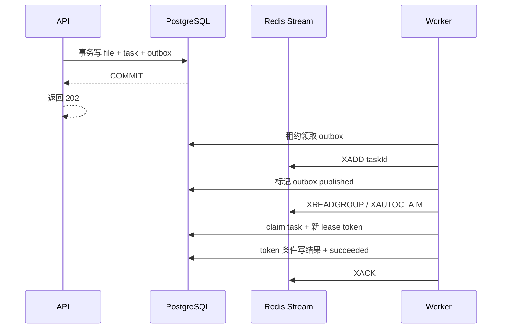

# ADR 0001：使用 PostgreSQL Outbox、Redis Streams 与数据库租约交付解析任务

- 状态：已接受
- 日期：2026-07-10
- 决策范围：Phase C1 可靠 worker

## 背景

阶段 B 在 API 进程内执行 `DevelopmentDocumentParser`。这能验证上传和任务状态，但 API 重启、滚动发布或多副本运行时无法可靠地移交工作，也没有跨进程抢占、心跳和过期恢复能力。

文件元数据、任务状态和解析结果的事实来源已经是 PostgreSQL，原件位于 S3。下一步需要把任务执行移出 API，同时避免以下双写缺口：

- 先提交数据库、再投递队列：进程可能在两步之间退出，留下永远没有消息的 `queued` 任务。
- 先投递队列、再提交数据库：worker 可能收到尚不存在或最终回滚的任务。
- 仅依靠 Redis 锁：锁过期后旧 worker 仍可能提交结果，覆盖新 worker 的正确状态。

Phase C1 仍使用 `DevelopmentDocumentParser` 的固定开发结果。真实 PDF/DOCX 文本、版面与 locator 解析属于 Phase C2，不在本决策中。

## 决策

### 1. API 只提交 PostgreSQL 事务

API 在同一个 PostgreSQL 事务中写入文件元数据、`queued` 任务和 outbox 事件，随后返回 `202 Accepted`。API 不连接 Redis，也不在 PostgreSQL 模式下执行解析器。Redis 故障因此不会把已持久化的上传变成 HTTP 双写失败。

默认的 `REPOSITORY_DRIVER=memory` 开发路径保留进程内解析器，以便无 PostgreSQL、Redis 和 S3 时快速联调；它不具备持久交付语义。

### 2. 独立 worker 承担 relay 与消费

独立 worker 进程运行两个循环：

1. outbox relay 以短租约批量领取未发布事件，向 Redis Stream `XADD` 任务消息，成功后标记事件已发布；
2. consumer group 通过 `XREADGROUP` 消费新消息，并通过 `XAUTOCLAIM` 接管超过 `REDIS_CLAIM_IDLE_MS` 的 pending 消息。

消息只携带定位任务所需的标识。worker 必须重新从 PostgreSQL 读取任务、租户、文件和对象引用；Redis 消息不是业务事实。

### 3. PostgreSQL 租约与 fencing token 决定写权限

worker 处理消息前，使用条件更新从 PostgreSQL 领取任务。Redis pending 接管会持续使用 `XAUTOCLAIM` 返回的游标轮转 PEL，避免前段活跃消息让后段崩溃任务饥饿。领取成功时：

- 将任务切换为 `running`；
- 增加 `attempt`；
- 写入唯一的 `lease_token`、`lease_owner` 和 `lease_expires_at`。

心跳和所有进度、成功、失败写入都必须同时匹配任务 ID 与当前 `lease_token`。每次重新领取都生成新 token；旧 worker 即使在网络恢复后继续运行，也会因 token 不匹配而失去提交资格。这一数据库条件写是 fencing 边界，Redis pending 所有权或进程内锁不能替代它。租约有效期、过期接管和退避可用时间以 PostgreSQL `clock_timestamp()` 为权威；worker 只提供所需持续时间，不能用偏移的本机绝对时钟延长租约。

解析结果与 `succeeded` 状态在同一个 PostgreSQL 事务中提交。只有结果事务成功、任务已经是无需处理的终态，或重试状态已经持久化后，才确认 Redis 消息。租约丢失的 worker 不得写终态，只能停止当前结果提交。

### 4. 交付语义是 at-least-once

outbox relay 在 `XADD` 成功、标记 published 前退出会造成重复消息；consumer 在数据库提交后、`XACK` 前退出也会造成重复消费。这些重复是预期行为，依靠任务状态、幂等结果写入和 fencing token 保证不会重复提交业务结果。

本系统明确提供 **at-least-once delivery + fenced effects**，不宣称 exactly-once：

- 单个消息可能被 relay 或 Redis 再次交付；
- parser 的外部副作用必须由调用方提供幂等键，或放在数据库 fencing 边界之后；
- PostgreSQL 是任务状态事实来源，Redis 不负责证明业务动作只发生一次；
- 本地 Compose 的 Redis AOF `everysec` 与持久卷覆盖常规进程/容器重启，不等于跨机房灾难恢复承诺。

### 5. 失败、退避与耗尽

明确识别的对象存储或数据库瞬态错误按 `TASK_RETRY_BACKOFF_MS` 退避，并在租约过期或 pending 接管后继续；永久完整性错误直接进入失败。任务本行的 `next_attempt_at` 是领取门禁，并与 queued 状态和 future outbox 在同一事务内更新，避免跨表快照让重复消息提前绕过退避。无论错误被捕获还是 worker 在领取后崩溃，`attempt` 达到 `TASK_MAX_ATTEMPTS` 后都由 PostgreSQL 原子转为 dead-letter `failed`，等待人工重试或重新上传。人工重试把 `attempt` 重置为 0，创建新的可投递状态和 outbox 事件，而不是依赖已经确认的旧消息。

参数必须满足：

- `TASK_HEARTBEAT_MS < TASK_LEASE_MS`；
- `REDIS_CLAIM_IDLE_MS >= TASK_LEASE_MS`；
- outbox lease 长于正常单批发布耗时，进程退出后仍能自然过期并被其他实例接管；
- `WORKER_ID` 在同时运行的 worker 中唯一；outbox relay 还会追加进程级 UUID 作为 lease owner，避免滚动重启复用 worker ID 时旧实例释放新 claim。

## 处理流程

## 配置

| 变量 | 默认值 | 作用 |
|---|---:|---|
| `REDIS_URL` | — | worker 必填的 Redis 连接串；API 不消费它 |
| `REDIS_STREAM_KEY` | `aibid:parse-tasks` | 解析任务 Stream |
| `REDIS_CONSUMER_GROUP` | `aibid-parser` | worker consumer group |
| `REDIS_CLAIM_IDLE_MS` | `60000` | pending 消息允许被接管前的最短 idle 时间 |
| `WORKER_ID` | `hostname:pid` | 可显式覆盖的 worker/consumer 唯一标识 |
| `WORKER_CONCURRENCY` | `2` | 单 worker 最大并发任务数 |
| `TASK_LEASE_MS` | `30000` | PostgreSQL 任务租约时长 |
| `TASK_HEARTBEAT_MS` | `10000` | 任务租约续期周期 |
| `TASK_MAX_ATTEMPTS` | `3` | 自动尝试上限 |
| `TASK_RETRY_BACKOFF_MS` | `1000` | 自动重试基础退避时间 |
| `OUTBOX_POLL_INTERVAL_MS` | `250` | 无待发布事件时的轮询间隔 |
| `OUTBOX_LEASE_MS` | `10000` | relay 对 outbox 事件的领取租约 |
| `OUTBOX_BATCH_SIZE` | `20` | 单次 relay 领取上限 |

## 后果

正面影响：

- API 与队列投递之间不再存在不可恢复的应用级双写窗口；
- worker 可以独立扩缩容，崩溃后的 pending 消息和数据库任务可恢复；
- fencing token 阻止过期 worker 提交陈旧结果；
- Redis 不可用时 API 仍可持久化上传，任务在 outbox 中积压。

代价与限制：

- relay、pending 接管、租约续期、重试和监控增加了运维复杂度；
- 消费者必须按重复投递设计，不能把 `XACK` 当成业务提交；
- Redis AOF、PostgreSQL 和对象存储仍需备份与恢复演练；
- Phase C1 只验证可靠交付，输出仍是 `development-fixture`，不能用于真实招标文件或准确率验收。

## 被拒绝的方案

- **API 直接写 Redis**：数据库和队列无法原子提交，会产生丢任务或幽灵任务。
- **仅轮询 `tasks` 表**：可实现但会把调度压力长期压在业务库，且缺少 Redis consumer group 的 pending 管理；保留数据库扫描作为运维对账思路，不作为主链路。
- **Redis List/PubSub**：PubSub 不持久，List 缺少 consumer group 与 pending 接管语义。
- **用 Redis 锁代替数据库租约**：无法阻止持有过期锁的 worker 对 PostgreSQL 写入。
- **宣称 exactly-once**：网络中断时无法同时原子确认 PostgreSQL 结果与 Redis 消息；重复交付是系统必须处理的正常情况。
